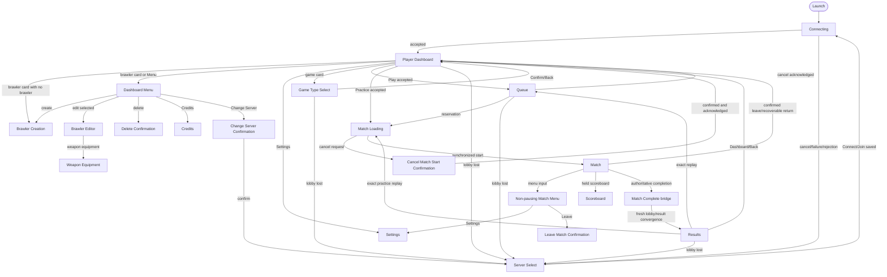

# PewPew Blitz — Complete UX/UI Audit

**Audit date:** 2026-08-23 (performed 2026-08-24, Europe/Paris)  
**Audited revision:** `5770824`, plus the visible uncommitted documentation work listed under
`Scope and method`  
**Primary reference:**
`references/best-practices/Out-of-Game-UX-UI-Unified-Guidelines.md`  
**Product contracts:** `docs/00-product-direction.md`, `docs/05-gameplay-loops.md`,
`docs/11-art-and-presentation-direction.md`, and `docs/13-player-ux.md`

---

## 1. Executive assessment

PewPew Blitz has a sound UX skeleton and a conspicuous presentation gap.

The skeleton is unusually strong for a game at this stage. The connected flow is shallow, Play and
Practice are close to the Dashboard, authority and asynchronous state are represented honestly,
Back and Cancel behavior is mostly deterministic, destructive actions are confirmed, responsive
Dashboard focus has been engineered carefully, and recovery usually returns the player to a useful
surface instead of a dead end.

The presentation gap is that only the Dashboard feels like a designed game surface. Most child
screens, management flows, settings, queue/loading, results, and the in-match menu still feel like
developer-facing forms made from centered text and full-width buttons. The functional contract is
often better than the visible communication of that contract.

The result is best described as a **strong functional beta, not a release-quality UX**:

| Area | Assessment | Summary |
|---|---:|---|
| Information architecture | 4.5 / 5 | One connected home, shallow branches, no competing hubs |
| Authority, waiting, and recovery | 4.5 / 5 | Factual pending/rejection/retry behavior is a defining strength |
| Navigation and focus | 4 / 5 | Strong Dashboard and shell handling; inconsistent implementations remain |
| Dashboard | 4 / 5 | Clear action hierarchy and responsive behavior; raw IDs and glyph defects reduce polish |
| Brawler/build management | 2.5 / 5 | Complete functionally, but weak findability, comparison, and consequence communication |
| Settings and accessibility | 2 / 5 | Useful capabilities exist behind a poor settings interaction model; key gaps remain |
| Match HUD and combat feedback | 2.5 / 5 | Legible baseline facts, but utilitarian, color-dependent, and weak at teaching outcomes |
| Results and build-learning loop | 2 / 5 | Honest outcome and replay, but little explanation, contribution, or learning support |
| Visual/system coherence | 2.5 / 5 | Branded Dashboard beside generic utility screens and text-heavy gameplay UI |
| Cross-platform readiness | 1.5 / 5 | Desktop keyboard/mouse/controller paths exist; touch/mobile is not implemented |

### Highest-value strengths to preserve

1. **The Dashboard is the sole connected home.** This keeps ordinary play close and prevents a
   proliferation of feature-owned hubs.
2. **The interface does not invent authority.** Population can be “updating,” connection is broken
   into factual stages, queue cancellation waits for acknowledgement, and replay is disabled when
   the exact previous game is unavailable.
3. **Draft and commit semantics are coherent.** Game type, brawler edits, equipment, and settings
   generally separate local drafts from accepted server or persisted state.
4. **Escape paths are explicit.** Queue, match loading, live match, server changes, deletion, and
   errors have bounded cancellation, confirmation, or recovery rules.
5. **The responsive Dashboard and focus repair are real implementations, not aspirations.** Wide
   and Compact layout, disabled-target skipping, spatial navigation, and focus-following scroll are
   meaningful foundations.
6. **Presentation is kept out of authority.** UI emits bounded intent and presents accepted state;
   it does not mutate gameplay truth.

### Highest-priority problems

| Priority | Problem | Why it matters |
|---|---|---|
| P0 | Permanent brawler choices lack gameplay consequences | The player is warned that profile/base choices are permanent without being told what those choices do |
| P0 | Touch/mobile has no complete path | The unified reference treats touch as co-primary; current gameplay and shell do not meet that target |
| P0 | Settings can render overlapping error systems | `shell.rs` creates a local error panel while `flow.rs` can create a second `ClientOverlay::Error` panel |
| P1 | Disabled actions rarely show a visible reason and remedy | The guidelines explicitly reject gray-only disabled states; accessible labels are not a substitute for visible explanation |
| P1 | Brawler management does not scale to the allowed 16 saved brawlers | “Select next brawler” is a cycle command, not a collection surface that answers “which?” |
| P1 | Player-facing text leaks internal IDs and simulation units | `Profile 1`, `Weapon base 1`, `Map 3`, `W3`, and ticks undermine comprehension and product polish |
| P1 | Results do not complete the build-learning loop | Players see the outcome but not their contribution, what the build did, or a useful next refinement |
| P1 | Most screens have no semantic action hierarchy | Save, Back, Delete, Quit, Retry, and neutral choices often share the same visual treatment |
| P1 | Settings is a text dump plus a button grid | Valuable capabilities are difficult to scan, understand, or operate as ordinary settings |
| P1 | In-match relationship and status cues depend too heavily on color and terse text | This conflicts with the product’s own readability and accessibility principles |

### Recommended product-level direction

Do not add a larger global navigation shell. Keep the current graph and conduct a **coherence and
decision-quality pass**:

1. establish a small shared visual/action language outside the Dashboard;
2. replace brawler cycling with a real Arsenal collection/detail flow;
3. rebuild Settings as categorized rows with direct values and clear Apply/Cancel behavior;
4. humanize every player-facing definition, statistic, duration, and state;
5. add visible disabled reasons and consistent pending treatment;
6. make Results teach one useful thing and lead naturally to Play Again, Dashboard, or Edit Brawler;
7. upgrade match feedback around damage, defeat, respawn, objectives, and team identity;
8. decide explicitly whether touch/mobile is in the next release target. If it is, treat it as a
   full input/layout milestone, not a late mapping exercise.

---

## 2. Scope and method

### Evidence reviewed

This audit combined:

- the complete 934-line Unified Guidelines;
- the product, gameplay-loop, art/presentation, network-adjacent, and player-UX contracts;
- the current client surface implementation, especially:
  - `src/client/flow.rs`;
  - `src/client/dashboard.rs`;
  - `src/client/shell.rs`;
  - `src/client/settings/*`;
  - `src/client/presentation.rs`;
  - `src/client/hud.rs`;
  - `src/combat/client/hud.rs`;
  - `src/client/input.rs`;
  - `src/client/session.rs`;
  - `src/diagnostics/overlay.rs`;
- the Balance Lab operator UI under `tools/balance-lab-web/`;
- V5 and V7 implementation/playtest records and the current backlog;
- the checked-in gameplay capture at `images/1.png`;
- the two Dashboard inspiration images;
- a fresh native routed-server/client run at a logical 1280×720 window with three scheduled
  screenshots of the authenticated Dashboard.

The working tree changed while the audit was in progress. At final verification, authored source
files were clean and the visible uncommitted work consisted of documentation/audit/data paths,
including V10 planning. The source assessment therefore targets revision `5770824`; V10 proposals
are not treated as shipped UX.

### Live visual observations

The live Dashboard confirmed:

- the fighter is the visual center;
- Play is unmistakably dominant;
- Practice, game type, selected brawler, identity, Settings, and Menu are simultaneously visible at
  the audited wide size;
- the quiet dark background and bright cards provide strong separation;
- the current model/wordmark/icon combination is coherent enough for functional production use;
- the brawler summary visibly exposes internal identifiers (`Profile 1`, `Weapon base 1`);
- the separator glyph between those facts rendered as missing-glyph boxes in the native capture;
- the screen is much more polished than the generic flow/overlay builders used downstream.

One of the three scheduled captures omitted most text and several images while preserving panel
geometry and part of the 3D preview. This may be a screenshot/render-atlas capture artifact rather
than a player-visible frame. It is not classified as a shipped flicker defect without reproduction
in direct observation, but it should be investigated if automated visual evidence is expected to be
trustworthy.

### Limitations

This was not a complete human factors playtest. The following were not directly validated:

- physical controller feel;
- a complete live traversal of every overlay in the native client;
- VoiceOver or another screen reader;
- touch targets, safe areas, device cutouts, virtual keyboard, or mobile gameplay;
- color-vision impairment simulation;
- reduced-motion behavior during a full match;
- comprehension with first-time players;
- localization expansion or non-Latin player-entered text;
- subjective audio mix under simultaneous combat.

Claims based only on source or recorded evidence are described as such. “Not implemented” is not
automatically a defect when the product explicitly defers the capability; it is still identified
when it prevents conformance with the requested cross-platform guideline.

---

## 3. Canonical experience and complete flow map

### 3.1 Player flow



The graph is appropriately shallow. The longest ordinary configuration branch is Dashboard → Menu
→ Brawler Editor → Weapon Equipment. There is no Title screen and no second disconnected home.
Those are good, deliberate product decisions.

### 3.2 Surface inventory

#### Primary `ClientFlow` states

| Surface | Dominant player question | Entry | Main exits | Primary implementation | UX maturity |
|---|---|---|---|---|---|
| Connecting | Is the game reaching the server? | Launch, retry, manual connect | Dashboard or Server Select | `spawn_connecting`, `connection_presentation` in `src/client/flow.rs` | Strong functional |
| Server Select | Which server and identity should I use? | Failure, cancel, change server | Connecting, Settings, Quit | `spawn_server_select_root` | Functional wireframe |
| Dashboard | What do I want to play, with which brawler? | Successful lobby join, normal returns | Child flows, Queue, Match Loading | `spawn_dashboard`, `src/client/dashboard.rs` | Best surface |
| Game Type Select | Which advertised activity should I commit? | Dashboard game card | Dashboard | `spawn_game_type_select` | Functionally complete, visually weak |
| Queue | What was accepted, what am I waiting for, can I cancel? | Accepted multiplayer admission | Match Loading or Dashboard | `spawn_queue`, queue model | Honest but sparse |
| Match Loading | Is the reserved match ready, and can I cancel? | Reservation accepted | Match or Dashboard | `spawn_match_loading`, loading model | Honest but sparse |
| Match | What should I do now, and what is the match state? | Synchronized countdown/start | Results or Dashboard | `presentation_3d/*`, `presentation.rs`, `hud.rs` | Playable baseline, substantial polish debt |
| Results | What happened, and what should I do next? | Match-complete convergence | Replay or Dashboard | `spawn_results` | Too thin |

#### Product overlays and transient surfaces

| Surface | Purpose | Origin/return | Implementation | UX maturity |
|---|---|---|---|---|
| Settings | Local input, display, audio, and accessibility preferences | Connecting, Server Select, Dashboard, Match Menu | `src/client/shell.rs`, `settings/*` | Major redesign needed |
| Credits | Attribution and license summary | Dashboard Menu → Menu | `spawn_credits` | Adequate |
| Dashboard Menu | Connected utilities and brawler management entry | Dashboard → Dashboard | `present_dashboard_menu` | Overloaded list |
| Brawler Creation | Commit permanent profile/base and initial ultimate | First run or Menu → Dashboard | `present_brawler_creation` | Safe but under-explained |
| Brawler Editor | Edit name, ultimate, passives; reach equipment | Menu → Dashboard | `present_brawler_editor` | Functionally complete, poor comparison |
| Weapon Equipment | Configure four owned part instances with preview | Editor → Editor | `present_weapon_equipment` | Complete but dense and technical |
| Delete Brawler | Confirm permanent deletion by name | Menu → Dashboard | `present_delete_brawler_confirmation` | Safe semantics, weak danger styling |
| Cancel Match Start | Confirm withdrawal from reservation/loading | Match Loading → Match Loading | `present_cancel_confirmation` | Safe semantics |
| Leave Match | Confirm forfeit/leave while match continues | Match Menu → Match | `present_leave_confirmation` | Safe semantics; consequence copy is incomplete |
| Change Server | Confirm lobby disconnect | Menu → Menu/Dashboard or Server Select | `present_change_server_confirmation` | Good consequence statement |
| Flow Error | Contextual connection/queue/content/practice/persistence recovery | Contextual | `present_flow_error_overlay` | Strong categories/actions, generic presentation |
| Local Settings Error | Explain load/validation/save behavior | Settings | `spawn_error` in `shell.rs` | Useful copy, conflicting ownership bug |
| Match Complete | Preserve authoritative result during lobby return | Match → Results | `present_match_completion` | Correct non-interactive bridge |

#### Match sublayers, not destinations

| Sublayer | Purpose | Implementation |
|---|---|---|
| Waiting/check-in overlay | Ready prompt and roster readiness | `MatchPhaseOverlayText`, `phase_overlay_label` |
| Countdown | Authoritative start countdown | `CountdownHudText`, `countdown_label` |
| Match clock | Remaining active time | `ReadinessHudText` |
| Objective/score | Wipeout score or Hot Zone progress/control | `MatchHudText`, `ModeScoreView` |
| Local health/status | Health, slow, defeat | `CombatHudText` |
| Weapon/ultimate/status | Ammo, weapon phase, ultimate charge/state, sentry | `CombatAbilityHudText` |
| Fighter overhead UI | Name, health, ammo, relation/status | `presentation_3d/combat.rs` |
| Scoreboard | Roster, team, weapon code, state | `ScoreboardOverlay` and readiness HUD model |
| Match Menu | Resume, Settings, Scoreboard, Leave | `PauseOverlay`, `MatchMenuState` |
| Targeted-ultimate cues | Targeting line/ring and confirm/cancel prompt | `client/input.rs`, combat HUD, 3D presentation |
| Diagnostics | Network/authority development facts | `ClientDiagnosticsOverlayPlugin`, F3 |

#### Non-player and legacy surfaces

| Surface | Classification | Audit disposition |
|---|---|---|
| Balance Lab web UI | Development-only operator tool | Audited separately; it should not influence the player shell IA |
| Legacy Build Editor overlay | Product-binary compatibility/dead surface, not reachable in the current Dashboard flow | Remove from product composition when compatibility evidence permits |
| Direct-match build selection | Automation/legacy direct path | Exclude from product UX score; keep visually labeled as diagnostic if exposed |
| Diagnostics overlay | Development tool currently toggleable with F3 | Hide behind an explicit development build/config in release candidates |

---

## 4. Evaluation against the Unified Guidelines

### The five required player statements

| Statement | Result | Evidence and gap |
|---|---|---|
| I know where I am | Pass | Every primary surface has a heading; Dashboard is the only connected home; modal roots are lifecycle-bound |
| I know what changed | Partial | Catalog substitutions, pending state, errors, and authoritative outcomes are visible; Results does not explain personal contribution or build learning |
| I know what I can do | Partial | Enabled actions are explicit; disabled actions commonly lack a visible reason/remedy |
| I understand the consequences of my choice | Partial/fail for brawler creation | Queue and equipment echo accepted/current facts, but permanent profile/base choices have labels without gameplay descriptions |
| I can return to play when I am ready | Strong pass | Play, Practice, Play Again, Practice Again, cancel, and Dashboard returns form a coherent loop |

### Player needs

| Need | Assessment | Reason |
|---|---|---|
| Competence | Partial | Rules and some build effects are shown, but internal units, minimal comparison, and thin Results make learning difficult |
| Autonomy | Strong | No forced monetization/progression interruptions; drafts can be cancelled; Practice is direct |
| Relatedness | Limited by scope | Team/roster state exists, but parties/social/safety are intentionally not present |
| Immediacy | Strong | Auto-connect, one home, prominent Play, nearby Practice, and direct replay minimize administration |
| Trust | Excellent | Server facts, stale states, rejection, cancel acknowledgement, and exact replay are represented conservatively |

### Acceptance checklist

| Area | Status | Audit note |
|---|---|---|
| Play access | Pass | Play and Practice dominate the Dashboard |
| One dominant question per surface | Mixed | Dashboard/queue/loading are clear; Settings and Dashboard Menu combine too many intentions |
| Back/Cancel/Home semantics | Mostly pass | Explicit mappings and safe defaults; wording/return cues could be stronger |
| Context preservation | Mostly pass | Selection and scroll receive dedicated owners; more regression coverage is needed outside Dashboard/equipment/settings |
| Controller | Pass in source, not fully evidenced physically | Visible focus, disabled skip, deterministic repair; match menu is a separate primitive implementation |
| Touch | Fail/not implemented | No complete touch combat or mobile shell contract |
| Keyboard/mouse | Mixed | Shell buttons generally work; Match Menu has no pointer button entities; brawler naming is keyboard-centric |
| Responsive layout | Mixed | Dashboard is strong; several centered modal panels can clip at small effective heights/high UI scale |
| Build choice | Partial/fail | Signed part effects exist, but permanent choices and ultimate/passive differences are not explained well |
| Authority | Strong pass | Preview, pending, accepted, rejected, stale, and retry paths are structurally distinct |
| Disabled state | Fail | Reasons often exist only in accessible labels or adjacent technical copy |
| Notifications | Limited | No notification system exists; contextual notices are restrained and appropriate |
| Accessibility | Partial | UI scale, rebinding, inversion, reduced motion/effects exist; color, captions, screen-reader validation, text scaling, touch, and haptics remain gaps |
| Motion | Mostly pass | Motion is restrained and reduced-motion-aware; functional transitions are sparse |
| Waiting | Strong pass | Connection stages, queue cancellation, loading phase, and retries are factual |
| Progression/commerce/social | Not applicable | Correctly absent rather than represented as empty global destinations |
| Growth | Pass | Current IA can absorb Arsenal and contextual progress without adding a destination for every system |

---

## 5. Global findings and recommendations

### G-01 — Preserve the graph; improve the surface system

**Severity:** Strategic  
**Finding:** The navigation model is not the problem. The gap is that downstream surfaces do not
share the Dashboard’s hierarchy, component language, responsive behavior, or visual identity.

Most screens use `flow_root_node`, `spawn_heading`, `spawn_flow_button`, or
`spawn_flow_error_button`: centered column, cyan title, dark or plum full-width buttons, minimal
supporting visuals. This makes Server Select, Game Type Select, queue, loading, Results, brawler
management, and confirmations feel like variants of the same debug form.

**Recommendation:** define a small, private player-shell component language, not a general UI
framework:

- `ScreenHeader` with title, context, and Back/Close affordance;
- `PrimaryAction`, `SecondaryAction`, `DestructiveAction`, `QuietAction`;
- selected, disabled-with-reason, pending, and warning states;
- `FactCard`, `ChoiceCard`, `ComparisonRow`, `InlineStatus`, and `EmptyState`;
- Wide and Compact arrangements for collection/detail and long forms;
- shared typography, spacing, radii, border, focus, and color tokens.

Use the Dashboard visual language as the seed, but reduce its display scale for task surfaces. Do
not rebuild authority or flow ownership.

### G-02 — Give every action semantic weight

**Severity:** High  
**Finding:** Outside the orange Dashboard Play button, actions with very different consequences are
often visually identical. Delete, Quit, Save, Retry, Back, and harmless cyclic choices can all use
the same generator and background.

**Recommendation:** add explicit intent to button presentation:

| Intent | Use | Treatment |
|---|---|---|
| Primary | Confirm selection, Save, Retry, Play Again | Strong filled treatment, one per decision surface |
| Secondary | Back, Cancel, Keep Playing, Stay Connected | Neutral surface with clear focus |
| Destructive | Delete Brawler, Leave Match, Change Server, Quit | Warning color plus icon/text; never color-only |
| Quiet | Credits, favorite toggle, optional utilities | Lower visual weight |

Keep the safe action focused first in confirmation dialogs. Add explicit consequences immediately
above destructive commitment.

### G-03 — Visible disabled reasons are required

**Severity:** High  
**Finding:** The implementation correctly uses `InteractionDisabled` and often creates a good
`AccessibleLabel`, but visible UI can still show an inert control with only muted styling. This
violates the Unified Guidelines’ disabled-action contract.

**Recommendation:** every disabled action should expose a short visible caption:

- `PLAY — Create or select a valid brawler`;
- `PLAY — Current server capacity is in use`;
- `SAVE EQUIPMENT — This part combination is invalid`;
- `CONFIRM — Select a game type`;
- `REPLAY UNAVAILABLE — Previous game no longer advertised`.

If the reason is already in adjacent status text, visually associate it with the action using
layout and an icon. Keep the accessible label synchronized from the same presentation model.

### G-04 — Humanize all player-facing data

**Severity:** High  
**Finding:** Current UI leaks implementation vocabulary:

- Dashboard: `Profile 1`, `Weapon base 1`;
- Match Loading: raw map ID fallback;
- scoreboard: `W3`/`W?`;
- combat HUD: `COOLDOWN 12t`, `RELOADING 24t`;
- equipment: tick values, milliunit-derived reach, basis-point-style combinations;
- technical phrases such as `type labels are presentation only`.

The live Dashboard also showed missing-glyph boxes in the separator between profile/base facts.

**Recommendation:** create one presentation-formatting boundary that converts:

- stable IDs → authored display names;
- ticks → seconds with appropriate precision;
- range values → player-scale units or qualitative range bands;
- signed modifiers → `+2 damage`, `0.2 s faster reload`, `shorter range`;
- unknown/stale facts → human recovery copy, never wire/debug notation.

Validate the shipped font coverage for every punctuation mark and symbol used by player-facing
copy. Add a visual glyph smoke test containing the full UI punctuation set.

### G-05 — Build management needs an Arsenal, not a cycle command

**Severity:** High  
**Finding:** Profiles support up to 16 saved brawlers, but management offers `SELECT NEXT BRAWLER`.
This is fast for two entries and poor for finding, comparing, or understanding a medium collection.
The Dashboard brawler card enters the general Menu rather than a focused collection.

**Recommendation:** keep Dashboard as home, but make its brawler card open an Arsenal child:

```text
Dashboard
  → Arsenal overview (which brawler?)
      → Brawler detail (why/use/edit/delete?)
          → Equipment (how configured?)
```

At current collection size, a stable grid/list with selected/equipped state and role summary is
enough. Search is unnecessary. Preserve focus, selection, and scroll when returning from detail.

### G-06 — Permanent choices are under-informed

**Severity:** Critical decision-quality issue  
**Finding:** Brawler Creation explicitly warns that fighter profile and weapon base are permanent,
then exposes only their names through cyclic buttons. The player cannot inspect health/speed,
weapon behavior, range, cadence, strengths, weaknesses, or representative tradeoffs before the
irreversible commit.

**Recommendation:** make each permanent choice a selectable card with:

- display name and silhouette/icon;
- one-sentence playstyle;
- 2–4 meaningful facts;
- explicit tradeoff (`+health, −movement`, `wide burst, slow recovery`);
- side-by-side or delta comparison against the current draft;
- a final confirmation that names both committed facts.

If deletion and recreation are the only correction path, say that before confirmation. Consider
whether “permanent” is actually valuable to the player or only simplifies persistence; if it does
not create meaningful identity, allow changing it with appropriate validation.

### G-07 — Settings capabilities deserve a real settings UX

**Severity:** High  
**Finding:** The settings surface contains useful functionality—22 input fields, calibration,
rebinding, inversion, UI scale, reduced motion/effects, volume, focus mute, fullscreen, and vsync—
but presents them as dense text plus 19 large buttons such as `PREVIOUS FIELD`, `- VALUE`,
`MOVE Y`, `UI -`, and `VOLUME +`.

The selected setting is encoded by brackets in a text dump. Values are distant from the controls
that change them. Categories are absent. Direct pointer interaction with a specific setting row is
not the main model. This surface is much harder to understand than the underlying capability set.

**Recommendation:** rebuild it around player language:

- Controls;
- Accessibility;
- Audio;
- Display.

Use one row per value with the current value adjacent:

```text
UI scale                 110%        [−] [+]
Reduced motion           On          [toggle]
Master volume            70%         [slider / − +]
Move up                  W            [Rebind]
```

Show conflicts inline on the affected rows. Keep Apply, Reset, and Cancel in a stable action bar.
Preview reversible display/audio settings, but explain whether Cancel reverts the preview. Preserve
the current draft/persistence architecture.

### G-08 — Fix overlapping settings-error ownership

**Severity:** High bug risk  
**Finding:** On settings validation/save failure, `shell.rs` sets `ClientOverlay::Error(...)` and
also directly spawns its own `OverlayRoot` error. `flow.rs` independently observes the same
`ClientOverlay::Error` and can spawn a `FlowErrorRoot`. Both use high modal z-order and overlapping
recovery actions.

**Recommendation:** select one renderer/owner for settings errors:

- either keep the settings-local surface and represent its overlay variant separately from the
  global flow error;
- or route the full error through `FlowError` and let it return to the retained settings draft.

Add a rendered-tree regression asserting exactly one blocking root and one action set for load,
validation, save, retry failure, and continue-without-saving.

### G-09 — Results must close the learning loop

**Severity:** High product-loop gap  
**Finding:** Results correctly presents the authoritative outcome, game name, local team, final
mode score, replay availability, and Dashboard. It does not show the player’s contribution, the
selected brawler/build, an explanatory match event, or a route to refine the build. The gameplay
contract explicitly defines a build-learning loop; Results currently only supports repetition.

**Recommendation:** add a restrained three-part Results surface:

1. **Outcome:** Victory/Defeat/Draw and final objective score.
2. **Your match:** defeats, damage, objective contribution, survival/respawn facts, and brawler used,
   but only metrics that are server-owned and useful.
3. **Next choice:** Play Again/Practice Again as primary, Dashboard as secondary, and `Edit Brawler`
   as a contextual route.

Do not add reward claims, promotion, or a multi-step reveal chain. A single “build insight” should
be added only when its interpretation is reliable; raw telemetry is not automatically coaching.

### G-10 — Team and status meaning needs redundant cues

**Severity:** High accessibility/readability  
**Finding:** The match uses team colors, colored rings, overhead names/bars, and `T1`/`T2` text.
Color remains the dominant rapid relationship cue in the world. There is no visible colorblind
mode. Health, slow, cloak, reveal, and other status information is largely terse text, transparency,
or color treatment.

**Recommendation:** use redundant relationship coding:

- ally/enemy ring shape or segmented pattern, not only hue;
- `ALLY`/`ENEMY` iconography where rapid recognition needs it;
- colorblind-safe palette presets;
- status icon plus label/timer;
- objective ownership shape/pattern and text;
- consistent local-player marker.

Validate at the maximum supported roster and with reduced effects.

### G-11 — The match HUD is readable but not yet communicative enough

**Severity:** Medium/high  
**Finding:** The capture shows a clean arena, top-center timer, top-right objective, overhead health,
bottom-left health, and bottom-right weapon/ultimate facts. This is a solid baseline. It remains
text-heavy and lacks several feedback layers that help players understand a fast arena fight:

- hit confirmation and rejection clarity;
- damage direction/source;
- low-health escalation;
- local defeat/respawn countdown;
- concise elimination/score feed;
- off-screen objective/important threat cue;
- cooldown visualization that can be read peripherally;
- clearer ultimate targeting state across input devices.

**Recommendation:** prioritize feedback by decision impact. Start with local damage direction,
defeat/respawn, objective urgency, and graphical ammo/ultimate/cooldown states. Keep effects bounded
and server-convergent. Avoid a noisy kill feed unless attribution testing demonstrates value.

### G-12 — The Match Menu needs normal UI controls

**Severity:** Medium  
**Finding:** The menu is one text node whose selected row is prefixed by `>`. It is operated by
keyboard/gamepad code, not Bevy `Button` entities, so pointer activation is absent. It states
`MATCH CONTINUES`, which is excellent, but its visual and interaction model is below the rest of the
shell.

**Recommendation:** render four focusable buttons using the shared action system. Keep simulation
running, neutralize local gameplay intent, and retain the explicit warning. Add a subtle live-match
backdrop rather than implying pause. `Leave Match` should state the forfeit/roster consequence that
the server will apply.

### G-13 — Responsive coverage is uneven

**Severity:** Medium  
**Finding:** Dashboard Wide/Compact behavior is strong. Settings, Build Editor, and Equipment own
scroll. Several other overlays use centered fixed-percent panels without their own max-height or
scroll owner. At 640×360 with UI scale 1.4, Creation, Editor, Dashboard Menu, and confirmations can
become cramped or clipped even if the root itself is bounded.

**Recommendation:** apply a shared compact modal contract:

- safe padding and max height;
- internal scroll area with persistent action footer;
- focus-following scroll;
- no centered content that can extend beyond both top and bottom;
- 44–48 logical-pixel minimum hit areas;
- compact typography/density that preserves the decision model.

Add the same effective-size/UI-scale matrix used by Dashboard to every major overlay.

### G-14 — Accessibility exists as features, not yet as a complete contract

**Severity:** High for release readiness  
**Finding:** Strengths include explicit Dashboard accessible labels, Bevy disabled semantics,
visible focus, deterministic focus repair, UI scale, remapping, inversion, reduced motion, reduced
effects, and persisted preferences. Gaps include:

- no tested screen-reader activation path;
- no colorblind settings;
- no caption/non-audio framework for meaningful audio cues;
- no separate text/HUD scale;
- no screen-shake/haptics settings contract;
- no touch path or safe-area system;
- no physical-controller evidence for the current revision;
- fixed English strings and no localization layout strategy.

**Recommendation:** define a release accessibility matrix rather than accumulating isolated toggles.
Test tasks, not settings existence: connect after failure, create a brawler, change a build, start
Practice, cancel admission, complete a match, and edit controls with each supported modality.

### G-15 — Touch/mobile is a future product slice, not a supported modality

**Severity:** Critical if the guideline’s cross-platform target is binding  
**Finding:** Pointer-sized Bevy buttons may receive touch-like activation on some platforms, but
there is no complete touch navigation, combat controls, safe-area handling, thumb-reach layout,
virtual keyboard policy, or touch-specific HUD. The product direction explicitly lists a complete
mobile control scheme as outside the current identity prerequisite, and the backlog keeps mobile
outside the current candidate index.

**Recommendation:** make the scope decision visible:

- if desktop/macOS is the current release target, state that the audit’s touch clauses are deferred
  and do not claim cross-platform UI conformance;
- if mobile is a target, create a dedicated vertical slice covering shell plus one complete match,
  with representative devices, safe areas, target sizing, reach, input arbitration, haptics, and
  performance.

Do not infer mobile readiness from a responsive desktop Dashboard.

### G-16 — Input and focus ownership is robust but split

**Severity:** Maintainability risk  
**Finding:** Product flow uses integer `FlowNavigation`; Settings/Credits use Bevy `InputFocus` and
directional navigation; Match Menu uses its own `selected: usize`. Each works locally, but three
focus architectures increase the risk of inconsistent restoration, pointer behavior, disabled
handling, audio feedback, and accessibility semantics.

**Recommendation:** do not perform a broad rewrite solely for purity. First create shared behavioral
tests and presentation rules. Migrate Match Menu to ordinary buttons immediately. Then evaluate
whether product flow can adopt Bevy focus during a milestone that already touches all child
surfaces. The acceptance criterion is one consistent player contract, not one type name.

### G-17 — Diagnostics should not be a discoverable release surface

**Severity:** Low now, medium for release  
**Finding:** The F3 diagnostics overlay is installed in the normal windowed client and toggles when
the environment does not pin it. It is correctly observational, but exposes process/network facts
and consumes a global key in the product binary.

**Recommendation:** gate it behind a development feature, explicit launch flag, or non-release
configuration. Preserve it for verification; do not include it in the player screen map or help.

### G-18 — Localization and font coverage need an explicit boundary

**Severity:** Medium release-readiness  
**Finding:** Copy is constructed throughout systems with uppercase English, fixed font sizes, long
pipe-delimited rows, and hard-coded punctuation. The live glyph defect proves that even English
punctuation coverage is not yet reliable. Several buttons are already near width limits.

**Recommendation:** centralize player copy and definition display strings, verify font fallback,
allow wrapping without changing action order, and test pseudo-localized expansion at Wide and
Compact sizes. Player-entered names should render through a font stack that supports the accepted
character policy.

### G-19 — Functional feedback is honest but visually quiet

**Severity:** Medium  
**Finding:** Pending labels such as `JOINING…`, `STARTING…`, `CANCELLING…`, connection dots, and
reduced-motion-aware overlay entrance are good. Many accepted local interactions—cycling a profile,
changing an ultimate, selecting a slot—replace text without a clear causal transition, highlight,
or restrained audio acknowledgement.

**Recommendation:** add functional feedback before expressive motion:

- immediate pressed state;
- selection check/icon and short highlight;
- old/new value transition or delta emphasis;
- one restrained confirm/error/cancel audio family;
- reduced-motion equivalent with no spatial travel.

Do not reuse combat sounds as shell feedback.

---

## 6. Screen-by-screen audit

## 6.1 Connecting

**Purpose:** communicate automatic/manual connection progress and provide Cancel, Settings, and
Quit.  
**Implementation:** `ClientFlow::Connecting`, `PendingConnection`, `ConnectionStage`,
`spawn_connecting`, `connection_presentation`.  
**Presentation:** logo, centered dark panel, staged copy, three buttons.

### What works

- Launch attempts the configured server immediately; there is no administrative Title screen.
- Progress is split into resolving, routed connection, and compatibility/game-list stages.
- Candidate count and bounded remaining time are factual.
- Cancel is visible and focused by default.
- Settings and Quit remain reachable before gameplay.
- Animated dots acknowledge activity without inventing progress.

### Problems

- The first static frame says `PREPARING CONNECTION`; it only becomes stage-specific once the
  pending resource is available.
- The logo/panel treatment is functional but visually disconnected from the richer Dashboard.
- “Up to Ns remaining” can appear like a prediction even though it is actually a timeout ceiling;
  wording should make that explicit.
- Error transition can feel abrupt because the destination becomes the generic Server Select plus
  modal error.

### Improvements

- Rename the time line `Connection timeout in up to Ns` or omit it unless testing shows value.
- Keep the logo, add a restrained step indicator, and reuse Dashboard typography/color tokens.
- On failure, preserve the last stage/address in the recovery panel.
- Test Cancel during DNS, candidate contact, lobby check, and the exact frame of acceptance.

**Assessment:** A− functional UX, B− presentation.

## 6.2 Server Select

**Purpose:** manual recovery, address/name editing, favorites, recents, Settings, Quit.  
**Implementation:** `ServerSelectModel`, `ConnectionsFileV1`, parsing/resolution helpers,
`spawn_server_select_root`.  
**Presentation:** centered vertical list of full-width text buttons.

### What works

- Address parsing supports hostname, IPv4, bracketed IPv6, default port, and explicit errors.
- Favorites and recents have distinct persistence semantics.
- Display name can be edited separately from server address.
- Settings remains reachable after connection failure.
- Connect is an explicit commitment; joining does not silently create a favorite.

### Problems

- Address and name are presented as buttons with text/caret rather than recognizable form fields.
- Favorite Join and Remove are adjacent equal-weight rows; accidental removal is plausible and
  list scanning is noisy.
- Recents and favorites are not visually grouped with headers/empty states.
- A long list relies on the root scroll but does not preserve obvious selection grouping.
- Remove has no undo and no target-level overflow/context menu.
- The surface has no clear “last attempted server” summary beyond the fields.

### Improvements

- Use labeled text fields with validation below each field.
- Present Favorites and Recents as grouped server rows: server name/address, status unknown, Join as
  row activation, favorite/remove as a secondary icon action with text label.
- Give Connect primary treatment; Settings/Quit lower weight.
- Confirm or provide undo for favorite removal only if playtesting shows accidental activation.
- Restore focus to the failed field or Retry control based on error category.
- Add compact empty states rather than omitting groups silently.

**Assessment:** B for function, C for presentation/findability.

## 6.3 Player Dashboard

**Purpose:** sole connected home for selected brawler, selected game, Practice, Play, and utilities.  
**Implementation:** `spawn_dashboard`, `update_dashboard_live_facts`, responsive layout/focus helpers,
`ClientDashboardPlugin`.  
**Presentation:** branded header, identity/server chip, 3D brawler preview, build card, game card,
Practice, dominant orange Play.

### What works

- It answers the correct dominant question: what should I play now?
- Play is genuinely primary; Practice is clear but subordinate.
- Fighter identity is the visual center and makes authored builds feel personal.
- Server and player identity are visible without dominating.
- Current game rules, map pool, and population are available at the decision point.
- Wide and Compact layouts preserve semantics.
- Spatial controller/keyboard navigation and compact autoscroll are thoughtful.
- Pending admission disables configuration that would invalidate the request.
- Accessible labels incorporate current facts.
- Reduced motion/effects freeze the background treatment.

### Problems

- The live summary exposes raw profile/base IDs and rendered missing separator glyphs.
- The brawler card says `MANAGE BRAWLERS` but opens the general Dashboard Menu, not a brawler-focused
  collection.
- The 3D preview and build card share one semantic action but look like two separate targets; their
  linked focus needs to remain unmistakable.
- Disabled visible reasons are weak.
- Population/rules text is small and dense compared with the display type.
- The preview is a generic imported fighter/weapon representation; it does not communicate the
  selected permanent profile/base or equipped parts strongly.
- Dashboard notices are ephemeral text with no stable history or clear dismissal semantics.

### Improvements

- Replace IDs with `Default · Pulse Sidearm`, plus one role/tradeoff line.
- Fix glyph/font coverage and add visual regression coverage for actual strings.
- Open Arsenal directly from preview/build card.
- Use a linked focus treatment that frames preview plus build card as one compound target.
- Put visible disabled reasons directly under Play/Practice.
- Use authored icons for rules/map/population and reduce line density.
- Make the preview reflect profile/base and major equipped-part silhouette when content exists; do
  not block interaction on optional art readiness.
- Keep notices contextual, with deterministic clearing and an accessible live-region policy.

**Assessment:** A− information hierarchy, B visual finish.

## 6.4 Dashboard Menu

**Purpose:** connected utilities and current brawler management.  
**Implementation:** `present_dashboard_menu`.  
**Presentation:** centered modal list.

### What works

- It contains genuinely secondary utilities rather than weakening Dashboard Play hierarchy.
- Change Server has a subsequent confirmation.
- Favorite state is contextual to the actual connected target.
- Credits and Quit are available.
- Back is explicit.

### Problems

- It mixes three player purposes: brawler management, server management, and application utilities.
- `SELECT NEXT BRAWLER` is not a discoverable collection model.
- Create/Edit/Delete receive the same weight as Credits/favorite/Quit.
- Delete and Quit lack danger styling.
- The long “CREATE BRAWLER (PERMANENT PROFILE + BASE)” label is explanatory but clumsy.
- The brawler card routes here, so the player must parse unrelated utilities to change brawler.

### Improvements

- Move brawler actions to Arsenal.
- Leave Menu with Settings, Credits, Favorite Server, Change Server, and Quit.
- Use icon+label rows with grouped headings (`Server`, `Application`).
- Style destructive actions semantically and keep Back/Close consistent.

**Assessment:** C+.

## 6.5 Brawler Creation

**Purpose:** create one persistent saved brawler from permanent profile/base plus initial ultimate.  
**Implementation:** `BrawlerCreationDraft`, `present_brawler_creation`, server profile mutation.  
**Presentation:** blocking modal with cycle buttons and permanent-warning text.

### What works

- Empty profiles enter explicit creation immediately.
- Defaults provide a short controller path.
- Nothing is created silently.
- Permanent facts are clearly labeled as permanent.
- Confirm and Cancel are distinct actions.
- Server acceptance remains authoritative.

### Problems

- The most consequential choices have the least explanation.
- Cycling hides the option set and makes comparison difficult.
- No fighter preview/stat delta changes as the draft changes.
- Ultimate is selected here even though name/passives are deferred; the rationale is not apparent.
- Confirmation does not restate the exact permanent choices in a final sentence.
- Cancelling first-run creation leaves Dashboard without a playable brawler; the empty-state path
  should stay constructive without becoming coercive.

### Improvements

- Use profile and weapon-base choice cards with role, facts, and tradeoffs.
- Update the 3D preview and resolved weapon facts live.
- Show all available options at once in Wide; use a focused sheet/detail in Compact.
- Rename `CONFIRM CREATION` to `CREATE <name/default>` and restate permanent choices.
- Explain the recovery path: delete and recreate, or revise permanency.
- After Cancel on an empty profile, keep a clear empty-state card and visible reason on Play.

**Assessment:** B for safety, D+ for decision support.

## 6.6 Arsenal / saved-brawler selection (missing surface)

**Purpose that should exist:** find, inspect, select, create, edit, and delete one of up to 16 saved
brawlers.  
**Current implementation:** distributed across Dashboard card and Dashboard Menu cycle/edit/delete
actions.

### Gap

This is the most important missing out-of-game surface because player-authored brawlers are the
product’s long-lived identity. The guidelines say overview should answer “which?” and detail should
answer “why?” Current cycling answers neither once the collection grows.

### Recommended surface

- stable card grid/list;
- selected marker and `USED FOR NEXT MATCH` state;
- name, fighter profile, weapon base, role, validity/pending state;
- Create card up to the cap;
- direct Select as primary reversible action;
- Detail/Edit as secondary;
- delete only from detail/overflow, not the overview’s primary path;
- preserve focus and scroll on return;
- no search until collection size/testing justifies it.

**Assessment:** Missing high-value UX layer.

## 6.7 Brawler Editor

**Purpose:** edit mutable name, ultimate, two passives, and enter equipment; show permanent facts.  
**Implementation:** `BrawlerEditDraft`, `present_brawler_editor`.  
**Presentation:** modal list of cyclic value buttons.

### What works

- Permanent facts are read-only and clearly separated.
- Draft is local until Save.
- Duplicate passives are prevented while cycling.
- Inline invalid-name errors preserve the draft.
- Equipment is a coherent child task.
- Cancel returns without committing.

### Problems

- Ultimate/passive names have no descriptions, triggers, cooldown/charge implications, or tradeoffs.
- Cycling hides the option set and makes returning to a known choice cumbersome.
- No current/candidate comparison or build role summary.
- Name edit is an unusual mode inside a button, with a text caret but no recognizable text field.
- Pending save closes the editor; accepted/pending/rejected continuity depends on Dashboard/global
  feedback rather than staying visibly attached to the edited brawler.
- `SAVE CHANGES` and `CANCEL` share visual weight.

### Improvements

- Use tabs/sections: Identity, Abilities, Weapon.
- Select abilities from cards with one-sentence behavior and visible differences.
- Show a persistent brawler summary/preview and mark changed fields.
- Use a real text-field presentation with character limit, validation, paste, and virtual-keyboard
  readiness.
- Keep Save primary; Cancel secondary; show `Saving…` then accepted/rejected state without losing
  context.
- Provide `Test in Practice` after accepted save, not inside the local draft.

**Assessment:** B for state ownership, C− for usability.

## 6.8 Weapon Equipment

**Purpose:** edit four generic part slots from owned physical instances and preview resolved weapon.  
**Implementation:** `WeaponEquipmentDraft`, owned inventory, exact candidate resolution,
`present_weapon_equipment`.  
**Presentation:** full-height modal with summary text, four slot buttons, owned-part list, Save/Cancel.

### What works

- Four slots are explicit and interchangeable.
- Inventory ownership and instance identity remain authoritative.
- A part equipped by another brawler is named rather than silently moved.
- Draft changes are resolved through the real weapon rules.
- Invalid combinations disable Save.
- Signed effects are present.
- Mouse scroll, retained scroll, focus-following scroll, Save, and Cancel are implemented.

### Problems

- It is dense, technical, and list-heavy.
- Effects use implementation units and awkward combined modifiers.
- The preview provides an absolute final sheet, not a clear current-versus-candidate delta.
- Lower fire/refill interval is better, but a signed raw interval can look like a regression.
- `OWNED PARTS — type labels are presentation only` exposes an internal architecture disclaimer.
- Selection is indicated with a `>` prefix rather than a designed selected state.
- Items equipped elsewhere appear actionable and then reject inline; availability should be clear
  before activation.
- Save disabled reason is indirect.
- The current slot, current part, candidate part, and net build consequence compete in one column.

### Improvements

- Wide: slots left, inventory center, comparison/preview right.
- Compact: slots → focused part picker sheet → comparison → Equip.
- Show `Current` and `Candidate` absolute values plus signed/descriptive deltas.
- Translate cadence into seconds and “faster/slower,” not raw ticks.
- Group inventory by compatibility or effect role only if current inventory size justifies it.
- Make equipped-elsewhere items disabled with `Equipped by <name>` and a route to inspect that
  brawler; do not silently transfer.
- Give invalid combinations a plain-language reason and remedy adjacent to Save.
- Replace internal disclaimer with useful player language such as `Part role: Refill`.

**Assessment:** Strong transaction design, weak decision presentation; C+.

## 6.9 Game Type Select

**Purpose:** inspect advertised activities and commit one exact game type/revision.  
**Implementation:** `GameTypeSelectionDraft`, lobby advertisements, `spawn_game_type_select`.  
**Presentation:** one pipe-delimited text button per game plus a population line, Confirm, Back.

### What works

- Draft/Confirm/Back behavior is correct.
- Exact ID and configuration revision are committed only on Confirm.
- Mode, topology, rule target/time, map pool, and population are visible.
- It does not claim which map will be formed.
- Previous-game removal is explained.
- Population derives from server state.

### Problems

- Long `name | mode | NvN | maps | rules` rows are difficult to scan.
- Selected state relies on background/border styling with little structural emphasis.
- Mode and advertised game naming can repeat or conflict.
- Map pool names can overflow, especially in Compact/localization.
- Confirm can disable without a visible reason.
- No visual mode identity, objective explanation, or “best for” summary.

### Improvements

- Use activity cards: name, mode icon, team size, concise objective, time, map count/pool disclosure,
  population.
- Put detailed map pool/rules in selected-card detail rather than every overview row.
- Make card activation select the draft; keep explicit Confirm if commitment is desired.
- Restore focus to the Dashboard game card after Confirm or Back.
- Add visible `Select a game type` reason when Confirm is disabled.

**Assessment:** B for truth, C for scanning/presentation.

## 6.10 Queue

**Purpose:** show the frozen accepted request, fresh pool facts, and cancellation.  
**Implementation:** `ClientQueueModel`, `QueueMembership`, `spawn_queue`, live status update.  
**Presentation:** title, centered multiline status, Cancel button.

### What works

- Accepted game/build facts are frozen rather than reflecting later local edits.
- Population is privacy-safe and stale-aware.
- No fabricated waiting-player roster or wait estimate.
- Cancel remains in place and changes to `CANCELLING…` while acknowledgement is pending.
- Duplicate cancellation is prevented.

### Problems

- The surface is emotionally and visually dead for a potentially repeated wait.
- Accepted brawler identity is summarized technically rather than visually.
- “N waiting / M per match” lacks a clear interpretation when formation capacity is occupied.
- Cancel is the only action but receives generic treatment.
- There is no restrained ambient animation or rotating useful build/mode reminder.

### Improvements

- Present accepted brawler, game card, and honest population as three fact blocks.
- Keep Cancel stable in the primary-action location and immediately show pending state.
- Add restrained, reduced-motion-safe ambience from the selected map/theme, not fake progress.
- If formation is blocked by current capacity, say so factually.
- Do not add estimated wait until the server owns defensible estimates.

**Assessment:** A for honesty, C+ for experience.

## 6.11 Match Loading

**Purpose:** explain reserved worker startup, map/content synchronization, readiness, and
cancellation.  
**Implementation:** `ClientMatchLoadingModel`, server phases, `spawn_match_loading`, cancellation
confirmation.  
**Presentation:** title, phase text, topology/map/build summary, cancel button.

### What works

- Phase labels are server-owned: reserving, starting, connecting, synchronizing, waiting,
  cancelling, returning.
- Topology and accepted build are visible.
- Cancellation uses confirmation and authority acknowledgement.
- Loading does not become a second lobby.

### Problems

- Map is shown by numeric ID in the primary formatter.
- Accepted build is reduced to points in legacy language even though the persistent-brawler model is
  richer.
- Participant readiness is not presented as a roster/checklist at this stage.
- The same generic screen style makes each phase feel like text replacement.
- Confirmation says `CANCEL MATCH START?` but not what happens to multiplayer queue membership in a
  race/return-to-queue case.

### Improvements

- Resolve map and brawler display names with artwork/silhouette where available.
- Use a real stage list with completed/current/pending semantics, never fake percentages.
- Show `Waiting for 3 of 4 players` when authoritative privacy-safe facts exist.
- Explain cancellation outcome: return to Dashboard or return to queue, based on actual policy.
- Keep phase changes immediate and accessible through a polite live region.

**Assessment:** B functional, C presentation.

## 6.12 Match waiting, countdown, and active HUD

**Purpose:** get ready, understand time/objective/team state, and make combat decisions.  
**Implementation:** `src/client/hud.rs`, `src/combat/client/hud.rs`, projected fighter UI, 3D cues.  
**Presentation:** top timer/objective, central phase/countdown overlays, bottom local facts, overhead
fighter state.

### What works

- Waiting, countdown, active, completed, and syncing states are separate.
- Countdown derives from authoritative deadlines.
- Wipeout and Hot Zone have mode-specific score/progress copy.
- Readiness and restart quorum are explicit.
- Local health, ammo, weapon phase, ultimate charge/state, slow, sentry, and defeat are exposed.
- The capture shows strong arena readability and restrained panels.
- World presentation and HUD remain independent from authority.

### Problems

- The HUD is dominated by monospaced text and numeric facts rather than peripheral shapes/bars.
- Cooldown/reload is in ticks.
- `T1`/`T2`, `W3`, terse status words, and color carry too much meaning.
- Local health has no bar/low-health treatment.
- Ammo dots appear overhead, while the local bottom panel is text; representations are inconsistent.
- The player can be defeated without a dedicated local respawn experience.
- Objective urgency, contest changes, and off-screen objective direction are weak.
- No caption/non-audio equivalence contract exists for audio cues.
- Maximum-roster clutter has not received a current subjective audit.

### Improvements

- Convert self health/ammo/ultimate to consistent bars/pips with text fallback.
- Add status icons and seconds, preserving labels.
- Add local defeat/respawn panel with spectating/state explanation where applicable.
- Add direction/edge indication for relevant off-screen objectives and damage.
- Give local player, ally, enemy, and objective ownership redundant shapes/patterns.
- Run impairment and maximum-roster visual tests with normal/reduced effects.

**Assessment:** B− gameplay baseline, C release polish.

## 6.13 Scoreboard

**Purpose:** inspect team roster, identity, weapon, status, and score while play continues.  
**Implementation:** held/latched `ScoreboardOverlay`, cached roster presentation.  
**Presentation:** centered dark text panel.

### What works

- Can be held during play or latched from Match Menu.
- Does not pause simulation.
- Cached entries preserve disconnected/respawn/protected state.
- Local player and team are textually identified.

### Problems

- Weapon identity is `W{id}` rather than a name/icon.
- Text columns are assembled manually and may not align with long/localized names.
- No semantic columns, row backgrounds, team grouping, or mode summary.
- Pointer/touch interaction is irrelevant for held use but the latched surface still lacks ordinary
  controls.
- It competes with the Match Menu as a separate selection implementation.

### Improvements

- Render team sections and roster rows with name, brawler/weapon, status, and contribution.
- Use stable display names and icons.
- Keep score/objective summary at the top.
- Make latched Close/Back explicit and restore focus to the Match Menu Scoreboard action.
- Avoid exposing data the server intentionally keeps private.

**Assessment:** C.

## 6.14 Match Menu

**Purpose:** resume, adjust settings, inspect scoreboard, or request leave without pretending to
pause the authoritative match.  
**Implementation:** `MatchMenuState`, `ClientInputContext::Menu`, `PauseOverlay`.  
**Presentation:** a single text block with `>` selection.

### What works

- `MATCH CONTINUES` is explicit.
- Gameplay actions are suppressed and neutral intent is sent.
- Resume is focused first.
- Settings returns to the menu.
- Leave requires confirmation.
- Scoreboard can be latched and Back returns to the menu.

### Problems

- No pointer buttons or accessible control nodes.
- It looks like a console/debug overlay.
- It resets selection to Resume on each open rather than restoring the invoking context.
- No live vulnerability reminder beyond title.
- Leave consequence is not described until an equally generic confirmation.

### Improvements

- Convert rows to standard focused buttons.
- Use a translucent live-world backdrop and a visible `Match is live` warning.
- Preserve menu focus when returning from Settings/Scoreboard.
- Add concise leave consequence (`You will forfeit and return to the Dashboard`).
- Keep Resume primary/safe and Leave destructive.

**Assessment:** B behavior, D+ presentation/input parity.

## 6.15 Leave Match Confirmation

**Purpose:** prevent accidental membership-changing leave.  
**Implementation:** `ClientOverlay::LeaveConfirmation`.  
**Presentation:** generic two-button modal.

### What works

- Safe action (`KEEP PLAYING`) is first and focused.
- Confirmation is proportional to consequence.
- Match keeps running honestly.

### Problems

- Copy does not explain forfeit, team impact, or return destination.
- Destructive action lacks danger styling.
- No live-match warning/timer is visible within the confirmation.

### Improvements

- State the exact server policy.
- Use a destructive style and retain safe default focus.
- Keep current score/time visible in subdued form if it helps the decision.

**Assessment:** B−.

## 6.16 Match Complete bridge

**Purpose:** preserve authoritative result while a fresh lobby session and Results converge.  
**Implementation:** `MatchCompletionRoot` inside `ClientFlow::Match`.  
**Presentation:** full-screen outcome plus `RETURNING TO LOBBY…`.

### What works

- It accepts no navigation, so it cannot become a conflicting results screen.
- It preserves the result and names lobby return honestly.
- It prevents a flash of live gameplay after completion.

### Problems

- It is visually generic and can feel like a second results reveal.
- Failure/retry during lobby return needs careful transition so the outcome is not lost.

### Improvements

- Treat it as a brief transition with the same outcome typography as Results.
- Keep duration driven by actual convergence, not a forced animation.
- If recovery takes perceptible time, preserve outcome and show factual reconnect stage.

**Assessment:** A− architecture, B− presentation.

## 6.17 Results

**Purpose:** explain authoritative outcome and support exact replay or Dashboard.  
**Implementation:** `ClientMatchResultState`, `spawn_results`, fresh lobby/game-type compatibility.  
**Presentation:** title, outcome, game/team/final score, replay, Dashboard.

### What works

- Victory/defeat/draw is localized to the player’s team.
- Forfeit is explicit.
- Final mode score is authoritative.
- Replay uses the exact previous game only when still compatible.
- Replay unavailability has a factual visible reason.
- Practice and multiplayer replay labels differ appropriately.
- Dashboard remains available.

### Problems

- No personal contribution or roster context.
- No selected brawler/build reminder.
- No “what changed” because progression is absent—which is acceptable—but also no “what did I do?”
- No route to edit the brawler, weakening the build-learning loop.
- Outcome celebration is visually flat and identical across meaningful result types.
- Dashboard and replay use generic button presentation rather than a deliberate next-action hierarchy.

### Improvements

- Add outcome hierarchy, final score, and one concise player contribution block.
- Show the brawler used and a contextual `Edit Brawler` route.
- Make exact replay primary; Dashboard secondary; editing tertiary.
- Use restrained victory/defeat-specific color, icon, sound, and motion with reduced-motion support.
- Do not add mandatory reward reveals or unrelated promotions.

**Assessment:** B for truth, C− for product value.

## 6.18 Settings

**Purpose:** configure input, accessibility, audio, and display before or during play.  
**Implementation:** `ClientShellSettings`, `ClientInputSettings`, drafts, persistence, Bevy
directional navigation.  
**Presentation:** scrollable overlay, two text blocks, help text, wrapping grid of buttons.

### What works

- Reachable from Connecting, Server Select, Dashboard, and Match Menu.
- Draft, preview, Apply, Cancel, Reset, validation, save retry, and session-only continuation exist.
- Input settings include deadzones, thresholds, rebinds, inversion, and conflict detection.
- Shell settings include UI scale, reduced motion, reduced effects, volume, focus mute, fullscreen,
  and vsync.
- Preferences persist.
- Focus and scroll are managed with Bevy directional navigation.
- Rebind capture has a clear cancel path.

### Problems

- The visible information architecture is effectively absent.
- Selecting one of 22 input fields through Previous/Next is inefficient.
- Values and controls are spatially disconnected.
- The button wrap order can make spatial navigation surprising as width changes.
- Product-draft keyboard shortcuts in the text hint are replaced, but the underlying text layout
  still reads like a developer calibration console.
- Toggle labels do not show state on the buttons.
- Master volume has no direct slider or current-value control.
- Apply/Cancel/Reset do not have semantic hierarchy.
- Error ownership can duplicate surfaces.
- There is no category landing/Back hierarchy or search.

### Improvements

- Rebuild as categorized setting rows.
- Directly focus/click the field being edited.
- Put value and adjustment on the same row.
- Use toggles, sliders/steppers, and per-action Rebind controls.
- Keep a sticky Apply/Cancel/Reset footer.
- Show preview/revert semantics clearly.
- Add accessibility rows for color, text/HUD scale, screen shake/haptics, and captions when those
  capabilities exist.
- Test every row with keyboard, mouse, controller, screen reader, and compact layout.

**Assessment:** A− capability ownership, D interaction design.

## 6.19 Credits

**Purpose:** attribution and license direction.  
**Implementation:** constant summary plus shipped full license files.  
**Presentation:** centered scrollable text and Back.

### What works

- Reachable from Dashboard Menu.
- Major dependencies/assets/authors/licenses are named.
- Full texts have a declared shipped path.
- Back is explicit and focus-restorable.

### Problems

- Fixed version copy can drift from actual package versions.
- Plain text does not group engine, art, audio, fonts, and maps.
- The shipped path is not interactively inspectable in the game.

### Improvements

- Generate summary facts from the validated asset manifest where practical.
- Group credits by category and make long license detail an optional child surface.
- Preserve simple Back behavior; no spectacle is required.

**Assessment:** B.

## 6.20 Confirmation surfaces

### Delete Brawler

Strong: names the target, says it cannot be undone, safe action first.  
Improve: destructive styling; clarify what happens if it is the selected/last brawler; return focus
to that brawler’s detail.

### Cancel Match Start

Strong: safe action first; authority acknowledgement.  
Improve: explain queue/roster consequence and destination; distinguish a reversible cancel from a
destructive action visually.

### Change Server

Strong: says it disconnects the current lobby; safe action first.  
Improve: include current server name and whether unsaved drafts/pending operations exist; style the
commit as membership-changing.

### Shared confirmation recommendation

Use one component with title, target/consequence, safe action, consequence action, and deterministic
focus restoration. Do not rely on identical full-width plum buttons.

## 6.21 Error and recovery surfaces

**Purpose:** classify failure and expose only valid recovery actions.  
**Implementation:** `FlowErrorKind`, bounded action array, contextual return flow, settings-local
error state.  
**Presentation:** dim backdrop, bordered panel, title/message, one or two actions.

### What works

- Error kinds are meaningful: Connection, Queue, Persistence, Content, Practice.
- Actions are bounded and contextual.
- Rate-limit retry is disabled with a factual countdown.
- Server loss leads to Server Select rather than pretending the Dashboard remains authoritative.
- Persistence errors distinguish retry, session-only continuation, defaults, and retained drafts.

### Problems

- Technical error strings may reach the player without a plain-language first line.
- All error actions share styling.
- Settings errors have overlapping renderer ownership.
- No stable error code/copy separation for support without exposing raw internals.
- Live-region/screen-reader announcement behavior is not explicitly tested.

### Improvements

- Compose `What happened`, `What was preserved`, and `What you can do`.
- Keep raw detail behind an optional `Details` disclosure or diagnostic log.
- Give Retry primary treatment, Back/Disconnect secondary/destructive treatment as appropriate.
- Unify settings error ownership.
- Test destination + overlay + focus + preserved-state as one matrix.

**Assessment:** A− recovery logic, C+ presentation.

## 6.22 Balance Lab (development-only)

**Purpose:** authoritative operator tuning for fighter profiles and weapon recipes during Practice.  
**Implementation:** React page with controller state, numeric tree editor, WebSocket/transaction
model, toast, sticky action bar.  
**Presentation:** responsive dark web tool.

### What works

- Clearly labels authoritative, dirty, pending, and offline states.
- Numeric controls pair range and exact value.
- Derived weapon summaries help interpret raw recipes.
- Revert, Restore Defaults, and Apply & Reset have distinct semantics.
- Toast uses `role=status/alert` and dismiss labeling.
- Responsive grid/action bar has mobile breakpoints.

### Problems

- The eyebrow still says `V7`, which can become stale.
- Large numeric trees are structurally accurate but cognitively expensive.
- Restore Defaults is consequential but not visually/interactionally confirmed.
- Disabled buttons rely on opacity without adjacent reasons.
- Keyboard focus, dirty-field navigation, and before/after comparison are not evident from the page
  code reviewed.

### Improvements

- Derive version/schema labels from the authoritative session.
- Add changed-field highlighting and a review-diff step before Apply & Reset.
- Confirm Restore Defaults or make it a reversible draft operation until Apply.
- Keep this tool visually separate from the player shell and excluded from release navigation.

**Assessment:** B+ operator UX; not part of player UX score.

---

## 7. Presentation and visual quality audit

### Current visual language

The game has two visual systems:

1. **Dashboard/game world:** branded, dimensional, colorful, model-driven, with clear large-scale
   hierarchy.
2. **Utility shell:** flat dark panels, cyan headings, monospaced/default text, uniform buttons.

The contrast is not merely a polish difference; it changes perceived product confidence. The
Dashboard says “game,” while Settings, Results, and management say “internal tool.”

### Typography

Strengths:

- Lilita One gives the Dashboard appropriate toy-like personality.
- Monospaced gameplay values remain legible against dark panels.
- Display and body roles are at least partially separated.

Problems:

- Body/UI fonts do not reliably cover used glyphs.
- Long all-caps labels reduce scanning.
- Technical rows become dense, especially in Game Type and Equipment.
- Fixed font sizes and hard-coded English risk Compact/localization clipping.

Recommendation: define display, title, action, body, data, caption, and danger styles with a tested
font fallback stack. Use display typography sparingly; keep data/body highly legible.

### Color and contrast

Strengths:

- Dashboard cards and Play have strong contrast.
- Dark gameplay panels support arena visibility.
- Warning/error copy uses more than the ordinary body color.

Problems:

- Disabled state often removes border but leaves similar white text.
- Team/relation state leans on hue.
- Some pale card body text is small.
- There is no colorblind configuration.

Recommendation: verify WCAG-like contrast as a diagnostic baseline, then test in motion at game
scale. Add shapes/icons/labels for relationship and status.

### Motion

Strengths:

- Motion is restrained.
- Shell entrance is brief.
- Reduced Motion disables shell travel and Dashboard background motion.
- Loading motion is factual and lightweight.

Problems:

- Most state changes are abrupt text replacement, so causality can be weak.
- No shared transition language links choice → detail → accepted state.
- One scheduled capture lost most text/images, so the visual-evidence pipeline itself needs
  reliability investigation.

Recommendation: add functional transitions only where they explain relationship. Never delay
operations for animation. Verify screenshot capture separately from user-visible rendering.

### Audio

Strengths:

- Ready and error cues exist and degrade to silence.
- Combat fire/impact/defeat cues are separate from authority.
- Focus-loss mute and master volume persist.

Problems:

- No dedicated shell confirmation/error/focus language.
- No SFX/music separation and no actual music baseline.
- No caption/non-audio equivalence contract.
- Subjective simultaneous-combat mix remains deferred.

Recommendation: add a restrained shell sound set only after action semantics are stable, separate
audio categories when actual content justifies them, and test combat mix with human listeners.

---

## 8. Implementation and architecture audit

### Strong implementation decisions

- `ClientFlow` gives primary screens explicit lifecycle ownership.
- `ClientOverlay` distinguishes modal concerns without turning them into independent authority.
- `PendingFlowActions` and `FlowCommit` centralize arbitration and reduce double dispatch.
- `DespawnOnExit` and overlay clearing protect destination transitions.
- Profile/equipment drafts are separate from accepted snapshots.
- Queue membership freezes accepted admission facts.
- Loading phases and Results compatibility derive from server/lobby facts.
- Dashboard preview assets/camera/targets have explicit cleanup.
- Dashboard responsive layout mutates marked nodes rather than rebuilding stateful hierarchy.
- Scroll/focus owners exist for Dashboard, Build Editor, Equipment, and Settings.
- Settings persistence uses validation, retry, and session-only continuation.

### Implementation risks

1. **`src/client/flow.rs` is an 8,000-line composition and presentation owner.** It contains state
   arbitration, input, screen builders, styling, formatters, and extensive tests. Ownership is
   understandable but change risk is high.
2. **Screen presentation is built from ad hoc strings.** This encourages internal-unit leakage,
   font surprises, duplicated wording, and localization difficulty.
3. **Three focus systems exist.** Product flow, shell, and Match Menu differ in pointer, focus, and
   accessibility behavior.
4. **Modal ownership overlaps for settings errors.** This is a concrete symptom of split surface
   ownership.
5. **Legacy Build Editor code remains in product flow.** It increases complexity and test surface
   even though persistent saved brawlers replaced it.
6. **Responsive behavior is screen-specific.** This was correct for the first demonstrated problem,
   but repeated overlays now justify a small shared modal/collection contract.
7. **Player copy reaches directly into stable IDs.** Presentation should resolve authored display
   data at one boundary.
8. **Diagnostics is composed into normal client startup.** Release gating is configuration-based,
   not build/surface isolation.

### Recommended refactoring boundary

Do not introduce a generic scene/UI framework. Split by demonstrated surface ownership:

```text
client/flow/
  mod.rs                 state, sets, action arbitration, transition commit
  navigation.rs          one product focus contract and tests
  presentation.rs        shared tokens/components/action intent
  connecting.rs
  server_select.rs
  dashboard_flow.rs      Dashboard actions, not preview renderer
  game_type_select.rs
  admission.rs           Queue + Match Loading surfaces
  results.rs
  errors.rs

client/arsenal/
  model.rs               local drafts/selection view models
  overview.rs
  detail.rs
  equipment.rs
```

Keep `dashboard.rs` as the preview/background lifecycle owner. Keep server/profile/queue models in
their current authority-oriented modules. Extract only when implementing the associated UX change,
not as an organization-only prerequisite.

---

## 9. Prioritized improvement plan

This is a UX recommendation sequence, not authorization to bypass the repository’s milestone
specification-review process.

### Phase 0 — Correctness and communication fixes

Small, high-confidence changes:

1. fix font coverage/missing separators;
2. replace raw profile/base/map/weapon IDs with display names;
3. convert ticks and technical modifiers to player units;
4. unify settings error ownership and test exactly one modal root;
5. add visible disabled reasons to Play, Practice, Confirm, Save Equipment, and Replay;
6. add semantic destructive styling to Delete, Leave, Change Server, and Quit;
7. gate F3 diagnostics for release configurations.

### Phase 1 — Shared surface language and Settings

1. Define small UI tokens and action intents.
2. Convert Match Menu to ordinary buttons.
3. Rebuild Settings into categorized rows with direct values.
4. Add compact modal scrolling/action-footer behavior to every overlay.
5. Run the full resolution/UI-scale/focus matrix.

### Phase 2 — Arsenal and build decision quality

1. Add Arsenal overview and brawler detail.
2. Replace `Select Next Brawler` with direct selection.
3. Add meaningful profile/base descriptions before permanent creation.
4. Add ultimate/passive choice cards and tradeoffs.
5. Rework Equipment around current/candidate deltas.
6. Add `Test in Practice` after accepted configuration.

### Phase 3 — Results and combat feedback

1. Add authoritative personal contribution and brawler used to Results.
2. Add contextual Edit Brawler route.
3. Add local damage direction, defeat/respawn, objective urgency, and graphical resource states.
4. Add redundant team/status cues and colorblind settings.
5. Tune audio/HUD/effects at maximum roster through human playtests.

### Phase 4 — Platform/accessibility readiness

1. Decide desktop-only versus mobile release target.
2. Validate screen-reader tasks and activation.
3. Add text/HUD scale, captions/non-audio equivalents, color modes, and shake/haptics controls as
   supported capabilities exist.
4. Add pseudo-localization and font-fallback testing.
5. If mobile is in scope, implement one complete touch shell+match vertical slice with safe areas
   and representative-device tests.

---

## 10. Recommended validation tasks and metrics

### First-time comprehension tasks

1. Launch after the default server is unavailable; connect to a manual address.
2. Explain the difference between fighter profile and weapon base before creating a brawler.
3. Create the first brawler and predict what cannot be changed.
4. Find and select a specific brawler among 8 saved entries.
5. Explain why Play is disabled and what will make it available.
6. Choose Wipeout 2v2 and explain rules/maps without activating it.
7. Equip a part and state exactly how the weapon will change.
8. Cancel queue and explain when cancellation has completed.
9. Open the live Match Menu and explain whether the match paused.
10. After Results, explain what the player contributed and what they would change.

### Modality matrix

Run every task with:

- keyboard only;
- mouse plus keyboard text entry;
- physical controller only for ordinary non-text paths;
- screen reader plus keyboard/controller where supported;
- touch on representative devices if mobile enters scope.

Switch input method mid-task and verify that selection, draft, focus, and prompts persist.

### Layout matrix

- 640×360 at UI scale 0.8, 1.0, and 1.4;
- 1280×720 at UI scale 0.8, 1.0, and 1.4;
- 1920×1080 and a high-DPI/Retina display;
- pseudo-localized text expansion;
- maximum supported player-name and brawler-name lengths;
- maximum saved brawlers and owned parts;
- maximum roster match with normal/reduced effects.

### What to measure

- time to Play and Practice;
- wrong destinations opened;
- unnecessary Back operations;
- focus loss or surprising directional move;
- failure to notice disabled/pending/accepted state;
- ability to predict permanent-choice consequences;
- arithmetic required to compare equipment;
- queue-cancel misinterpretation;
- Results comprehension and deliberate next action;
- match events whose cause cannot be explained;
- settings rows requiring external help;
- clipped or unreachable controls;
- visual defects in glyphs, focus, high DPI, and screenshot evidence.

### Release-level acceptance criteria

- Every consequential choice exposes consequence before commit.
- Every disabled action exposes a visible reason and remedy.
- Every player-facing ID/unit is humanized.
- One semantic action hierarchy is used across all surfaces.
- All major surfaces pass the effective-size/UI-scale matrix.
- Keyboard, mouse, and physical controller complete ordinary tasks without traps.
- Screen-reader labels/state are accurate and activation is tested if claimed.
- Team/status meaning does not rely on color alone.
- Results communicates outcome, personal contribution, and a useful next choice.
- No settings/error path creates duplicate modal roots or loses its draft.
- Touch/mobile is either fully scoped and tested or explicitly excluded from the release claim.

---

## 11. Final disposition

PewPew Blitz should keep its current Dashboard-centered flow. Its architecture already protects the
most expensive UX qualities: immediacy, trust, recovery, authority, and deterministic navigation.
The next UX investment should make those qualities visible and understandable everywhere.

The central gap is decision communication. Players can technically create, edit, equip, queue,
cancel, play, and replay, but they are not consistently shown:

- why a permanent choice fits them;
- what one build option changes relative to another;
- why an action is unavailable;
- what caused a match outcome;
- what they should refine next.

Addressing those questions—through an Arsenal surface, humanized comparisons, visible disabled
reasons, a real Settings interface, richer Results, and stronger match feedback—will produce more
value than adding new global destinations or decorative spectacle. The Dashboard has already shown
the target quality bar. The work now is to make the rest of the game feel like the same product.

