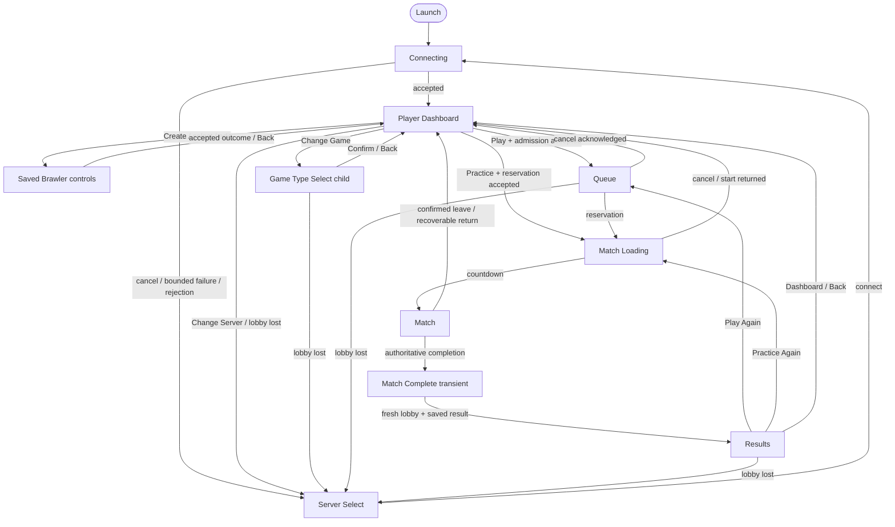

# Player experience specification

## Purpose and ownership

This document defines PewPew Blitz's durable player-shell, navigation, admission, settings,
accessibility, and recovery contracts. It describes the intended product experience rather than a
version checklist or implementation-status report.

The Dashboard-centered connected loop, direct server connection, server-local queues, routed match
handoff, practice allocation, local settings, and current recovery behavior are established
foundations. Capabilities explicitly described as **envisioned** are directions that still require a
version milestone and validation before they become product commitments. Version roadmaps and
milestones own delivery status, implementation evidence, playtest findings, and historical designs.

Related ownership is intentionally separate:

- [Gameplay loops](./05-gameplay-loops.md) owns the relationship among combat, match, practice,
  build-learning, and longer-lived player loops.
- [Network architecture](./08-network-architecture.md) owns gameplay authority, protocol evolution,
  transport-facing input, and replication.
- [Bots](./10-bots.md) owns the behavior and integration contract for playable practice bots.
- [Art, presentation, and asset specification](./11-art-and-presentation-direction.md) owns visual,
  audio, readability, and asset direction.
- [Multi-process server architecture](./14-multiplayer-server-architecture.md) owns supervisor,
  lobby-worker, match-worker, routing, and connection-handoff mechanics.

In this document, **matchmaking** means direct-connect, server-local, skill-free queueing. A player
connects to a known server, chooses one of its advertised game types, and asks that server to form a
match from the corresponding pool. Global matchmaking, server discovery, accounts, parties, rank,
and persistent social systems are not implied by this term.

## Experience principles

1. **Reach a useful choice quickly.** Normal launch attempts the configured server immediately.
   Success reaches the Player Dashboard; failure reaches a usable Server Select surface. Practice
   remains visible as the shortest route to controllable play when the server can host it.
2. **One connected home.** Dashboard owns fighter choice, game-type choice, Play, Practice, and
   connected utilities. Ordinary connected exits return there rather than forming competing hubs.
3. **Controller-first, keyboard and mouse first-class.** Focus, confirm, cancel, and back remain
   consistent across devices. Text entry is optional on ordinary controller paths.
4. **Draft locally; commit explicitly.** Fighter and game-type child surfaces edit local drafts.
   Confirm commits a selection; Back discards the draft. Neither surface starts admission.
5. **Show authoritative facts honestly.** Queue population, accepted builds, loading state,
   objective progress, outcomes, and replay availability are presented from current server facts.
   The client does not invent wait estimates, selected maps, or successful actions.
6. **Fail soft.** Recoverable problems preserve the nearest valid context and offer factual next
   actions. Lost authority clears stale state exactly once and leads to a usable recovery surface.
7. **Accessible competition remains readable.** Important information is not color-only, focus and
   disabled states are unambiguous, and players can reduce presentation that impairs play.
8. **Presentation never becomes authority.** UI produces bounded intent and presents accepted or
   replicated state. It cannot choose teams or maps, validate builds, award outcomes, or simulate a
   match.

## Canonical player flow

There is no Title screen or Title navigation layer.

`Match Complete` is a non-interactive bridge that preserves the authoritative outcome while the
client establishes a fresh lobby session. It is not a destination or an additional place for
player choices.

## Player-surface model

Primary destinations, modal presentation, and continuing-match input contexts are distinct
concerns. Their exact Bevy representation may evolve, but their ownership and return behavior must
remain explicit.

| Surface | Product role | Ownership contract |
|---|---|---|
| Connecting | Initial or manual lobby connection progress | May expose Cancel, Settings, and Quit; success enters Dashboard |
| Server Select | Recovery and manual connection | Owns address, display name, favorites, and recents; it does not pretend to be a connected home |
| Player Dashboard | Sole authenticated home | Owns the authoritative saved-brawler list and selection, selected game summary, Play, Practice, and connected utilities |
| Game Type Select | Dashboard child | Edits one local advertised-game draft; Confirm commits and Back discards |
| Saved Brawler controls | Dashboard child/overlay | Sends create, select, mutable edit, and confirmed delete intent; permanent fighter-profile/weapon-base facts are visible but never emitted by edit |
| Queue | Accepted multiplayer admission | Shows the frozen accepted request and honest pool facts; Cancel awaits acknowledgement |
| Match Loading | Reserved-match handoff and readiness | Shows server-owned progress and bounded cancellation or return behavior |
| Match | Authoritative gameplay | Owns world presentation, HUD, non-pausing menu, and scoreboard presentation |
| Match Complete | Transient result-preservation bridge | Accepts no navigation while lobby return and result capture converge |
| Results | Completed-match decision | Keeps the authoritative outcome visible and offers exact replay or Dashboard |
| Dashboard Menu | Connected utility overlay | Owns saved-brawler management, Credits, favorite-server action, Change Server, and Quit |
| Settings | Local settings surface | Returns to its explicit product-flow or match-menu origin |
| Credits | Attribution surface | Reached from Dashboard Menu; required attribution derives from the asset manifest |
| Confirmations | Destructive or membership-changing decisions | Preserve and restore their invoking context deterministically |
| Error | Contextual recovery surface | Presents a factual category and only actions valid for the underlying session state |

Gameplay HUD elements such as countdown, phase messages, health, ammunition, cooldowns, objective
state, and roster score are Match sublayers rather than navigation destinations. Developer
diagnostics and legacy direct-UDP controls are not product screens.

### Continuing match contexts

Opening the in-match menu does not pause authoritative simulation. Local gameplay actions are
suppressed and neutral intent is sent while the match continues and the fighter remains vulnerable.
Leaving requires confirmation and follows the server-owned forfeit and lobby-return policy.

The scoreboard is separately held during play or latched from the in-match menu. Presentation must
not accidentally turn it into a pause, a second primary flow, or an authority source.

## Launch, connection, and server selection

Normal launch attempts the configured server without requiring a preliminary menu. The Connecting
surface communicates resolution, contact, compatibility, and catalog progress without claiming
match readiness. A bounded failure, rejection, or explicit cancellation leads to Server Select.

Manual joining by `IP:port` or `hostname(:port)` remains available. A missing port uses the
documented default, and input is validated before connection. Favorites are explicit player-authored
`name`/`address` entries. Successfully joined servers may enter a separate bounded recent list;
joining does not silently create a favorite.

Changing server from Dashboard requires confirmation because it ends the authenticated lobby
session. Unexpected lobby loss does not ask for that confirmation and leads directly to Server
Select with a clear explanation.

Public server browsing is an envisioned extension tracked in the [backlog](./backlog.md). Direct
address entry and local favorites remain useful even if discovery is later added; discovery does
not by itself solve internet reachability, trust, or moderation.

## Dashboard and selection contract

Dashboard presents the selected saved brawler and selected advertised game type. It owns the only
ordinary Play and Practice actions. Saved-brawler creation/editing and Game Type Select are child
flows, not alternate hubs: they contain no queue, practice, favorite, server-change, or disconnect
controls.

Game Type Select edits a private draft from the current bounded server advertisement. Confirm
commits an exact current `GameTypeId` and revision; Back discards the draft. The UI describes the
advertised mode, topology, rules, and map pool without claiming which map formation will choose.

Creation starts from safe defaults, clearly identifies fighter profile and weapon base as permanent,
and requires confirmation. The brawler editor shows those permanent choices read-only while name,
ultimate, and the two ordinary passives remain editable. Confirm sends one revision-bound mutation
to the server-owned profile; Back discards the draft. Pending mutations disable admission and later
mutations until the authoritative whole-profile outcome arrives.

Responsive presentation does not change this semantic hierarchy. At an effective UI canvas of at
least `1000x640`, Dashboard uses the Wide hierarchy with its fighter/build focus and horizontal
game-type, Practice, and Play actions. Below either threshold, it uses the same targets in a
vertically scrollable Compact hierarchy. Effective size is logical window size divided by the
persisted UI scale.

Resizing preserves the selected model and preview target. Keyboard arrows/WASD and controller D-pad
follow spatial neighbors in Wide and visible order in Compact. Disabled targets are skipped, stale
focus is repaired deterministically, and Compact focus scrolls into view. Pointer, keyboard,
controller, and accessibility activation feed the same flow-action owner.

## Admission, queue, and match loading

Play submits the committed game type plus selected saved-brawler identity and expected revision to
the connected server's multiplayer admission path. Successful admission freezes the server-resolved
loadout snapshot on an immutable queue ticket. Editing thereafter requires acknowledged cancellation
and a new admission; a pending or accepted queue command never reopens an editor as its retry owner.

Each advertised game type has an exact server-owned topology. Its multiplayer pool contains human
tickets and forms only a complete roster; overflow remains queued. Queue presentation shows the
game type, the player's accepted build, and fresh privacy-safe population facts such as
`N waiting · M players per match`. Stale population is labelled as updating rather than passed off
as current, and no speculative wait time or waiting-player roster is exposed.

Practice bypasses multiplayer pools. It asks the connected lobby to reserve ordinary server
capacity for one authoritative match worker containing the player and manifest bot fighters. The
same advertised game type, build validation, maps, modes, match rules, and lifecycle apply. A full
server or incompatible game type is shown as unavailable rather than silently changing rules or
creating a practice wait list. [Bots](./10-bots.md) owns the distinction between the established
practice roster and envisioned playable bot behavior.

After reservation, Match Loading owns worker connection, selected-map and content synchronization,
participant readiness, and the one authoritative countdown. Cancellation and formation races are
resolved by the server before the UI changes membership state. A successful cancellation or
no-result lobby return converges on Dashboard; it does not disconnect or reopen a selector.

## Match and results

Match presentation communicates only facts useful to play: fighter health and combat resources,
time and phase, active mode score or objective, readable teams, bounded status alerts, and relevant
combat feedback. Raw ticks, transport state, control help, and process diagnostics belong in a
separate developer surface.

Confirmed leave, recoverable worker failure, and any no-result return establish a valid lobby before
returning to Dashboard. An interrupted match is not represented as resumable unless a future
continuity feature explicitly defines that behavior.

Results preserves the authoritative outcome and offers Dashboard plus exact replay. Replay is
enabled only when the exact previous game-type ID remains in the fresh lobby catalog. It uses that
entry's fresh configuration revisions, and the server revalidates the current accepted build and
admission request. Multiplayer replay enters Queue; practice replay requests a new practice
reservation. If exact replay is unavailable, Results keeps the outcome visible, disables replay
with a factual reason, and leaves Dashboard available.

A recoverable capacity or rate rejection may remain on Results so the player can retry or return.
A catalog, content, or protocol incompatibility follows the explicit reconnect recovery path.
Results does not duplicate fighter editing, game-type editing, server selection, or disconnect.

## Identity and local persistence

Stable player and network IDs remain authoritative. Display names are untrusted presentation
metadata, never identity or authorization. The server applies bounded normalization, character and
control validation, and deterministic duplicate handling. A usable generated default lets a
controller player complete the ordinary flow without text entry.

Settings, favorites, recents, display name, and the account binding for each logical server are local client data with explicit
schema versions, bounded input, atomic replacement, and safe fallback after missing or malformed
data. The retired local build file is neither imported nor rewritten. Favorites remain explicit;
recents remain bounded and automatic. None of this persistence
belongs in the dedicated-server feature graph.

V7 adds a fresh server-side persistent arsenal and does not import the locally saved build. An
account may own up to 16 brawlers, delete them, and reuse display names. Fighter profile and weapon
base are permanent creation choices; name, four generic weapon-part slots, ultimate, and both
passives remain editable outside queue. Queue admission freezes the brawler and every edit is
rejected while queued. The 12-point budget and the Runner, Bruiser, Controller, and Duelist builds
do not carry into this flow.

The V7 store uses SQLite WAL/transactions, versioned migrations, an operator backup command, and a
tested restore path. Unavailable storage fails fast. Corrupt storage is preserved for recovery;
unsafe records are rejected and reported without silently resetting owned data. Production
authentication and external identity schemes remain deferred. For V7, the client generates and
stores one opaque account ID per logical server. The server validates its bounded format and then
atomically loads or creates the profile; deterministic IDs provide the same idempotent path for
tests. There is no security check, recovery, or profile-creation rate limit. The UI must not describe
this development seam as a protected or recoverable account. Profiles are local to one logical
server and owned by `ProfileAuthority` in its long-lived lobby worker, backed by an exclusive SQLite
storage executor. Cloud saves, entitlements, progression, and cross-server profiles remain later
capabilities.

## Input, settings, and accessibility

The ordinary flow must remain operable by controller and keyboard/mouse. Address and optional-name
editing may use keyboard and paste, but saved servers and generated names prevent controller users
from requiring an on-screen keyboard.

The settings contract includes:

- action remapping, deadzones, aim threshold, sensitivity, Y inversion, conflict handling,
  reset-to-default, controller-disconnect handling, and active-device glyph changes;
- master, effects, and music-ready volume categories plus a clear focus-loss policy;
- supported window mode, resolution, synchronization or frame-limit policy, cursor behavior, UI
  scale, and safe layout margins;
- non-color-only team identification and a colorblind-friendly palette direction;
- reduced shake, flashes, motion, and effects without suppressing authoritative information;
- deterministic focus repeat, restoration, disabled-state repair, pointer interaction, and a clear
  visual and accessible focus indication.

Reduced Motion or Reduced Effects freezes non-essential procedural Dashboard motion. It does not
remove factual state, change navigation, or alter gameplay authority.

## Error and recovery contract

Errors map structured causes to the nearest honest action:

- invalid address, display name, or local file → correct locally or restore safe defaults;
- DNS or transport timeout → retry the same server or use Server Select;
- protocol or content mismatch → explain incompatibility without automatic retry loops;
- server full or game type temporarily unavailable → preserve a valid lobby and return to the
  invoking Dashboard or Results context;
- build rejection → preserve the editable selection and show the precise correctable reason;
- queue rejection or cancellation race → preserve the server-confirmed membership state and offer
  only valid retry, cancel, or Dashboard actions;
- formation or check-in failure → explain whether the ticket was restored or removed before
  changing presentation;
- match disconnect → explain that the match cannot currently resume, then attempt a fresh lobby or
  offer Server Select;
- server shutdown or lost lobby → clear connected state and return to Server Select without treating
  the event as an application crash.

An overlay may explain an error, but loss of the underlying session changes the primary flow. That
transition clears stale ticket, match, map, terrain, result eligibility, focus, and presentation
state exactly once.

## Authority and execution boundaries

The client owns presentation state, local drafts, focus, local settings, and bounded requests. The
lobby worker owns authenticated sessions, advertised game types, queue membership, ticket outcomes,
practice reservations, and match allocation. Each match worker owns authoritative simulation,
teams, selected map, fighter state, lifecycle, score, objectives, and outcomes.

Moving between lobby and match authority uses the routed connection-handoff contract. UI flow does
not introduce another gameplay protocol, process-local entity identity on the wire, or a second
simulation path. Headless automation may bypass visual presentation, but it must exercise the same
session, admission, handoff, match, and return protocols as the product flow.

## Verification contract

Player-flow changes should preserve representative evidence at the layer where failure is costly:

- flow and UI tests for every primary transition, modal return, draft Confirm/Back rule, focus
  restoration, disabled repair, exact replay gate, and error mapping;
- local persistence tests for schema handling, bounded input, atomic save, and safe fallback;
- schedule or ECS tests proving presentation cannot mutate authoritative gameplay and that scoped
  entities clean up exactly once;
- routed lifecycle tests covering connect, catalog, Play, Practice, queue cancellation, reservation,
  loading cancellation, match completion, leave, fresh-lobby return, Results replay, and loss in
  every connected phase;
- visual and accessibility checks across the supported window/UI-scale matrix, non-color team
  reading, reduced presentation, controller disconnect, glyph switching, and pointer/keyboard/gamepad
  parity;
- usability checks that a reachable server with capacity offers a short path to practice, a
  populated server offers a concise path to multiplayer, and no state promises unsupported wait or
  recovery behavior.

The matrix should remain representative rather than multiplying every device, resolution, scale,
timing, and failure into a Cartesian suite. Version milestones select the concrete risk cases and
record their evidence.

## Envisioned extensions

The following directions may extend this shell without changing its present authority boundaries:

- public server discovery coordinated with reachability and server policy;
- parties, invitations, private groups, and team-affinity rules;
- progression, entitlements, and cloud or cross-server profile persistence beyond V7's server-side
  arsenal;
- match resumption, join-in-progress, spectator, or tournament-observer flows;
- rank, leaderboards, social features, and moderation surfaces;
- broader platform-specific input, localization, and release-readiness support.

Each extension requires a focused candidate or milestone. It should attach to Dashboard or another
demonstrated owner rather than creating a new top-level hub or generic navigation framework in
advance.
