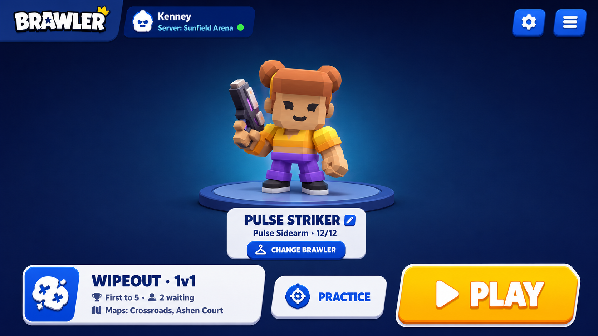

# V5 Milestone 01 — Auto-connect and player-dashboard vertical slice

Player-facing product name: **PewPew Blitz**. Historical repository/crate identifiers remain
unchanged during this research milestone.

| Field | Value |
|---|---|
| Status | Researching |
| Depends on | V4 closeout accepted on 2026-08-21; completed V2 routed product flow and V3/V4 client presentation foundations |
| Outcome | Normal launch attempts one server and reaches a functional connected Player Dashboard whose real brawler, game-type, session, Play, Practice, and utility actions form the new product center |

## Research question

What is the smallest dashboard-centered vertical slice that removes the ordinary Title/Game Select
hub path, preserves bounded routed connection recovery and server authority, presents the player's
authored brawler as the visual focus, and remains fully operable by keyboard, gamepad, and pointer?

## Requested experience

The user supplied a Brawl Stars dashboard screenshot as a hierarchy reference: a large central
character, a selected-mode card below it, a dominant Play button, and secondary systems at the
edges. PewPew Blitz should adopt that hierarchy without copying its art or importing features the
game does not own.

The repository contains the initial dashboard concept at `inspiration/player_dashboard.png` and
the corrected lead concept at `inspiration/player_dashboard_2.png`:



This is the lead information-hierarchy and composition reference, not a production-asset contract.
The second concept removes the carousel, uses the current low-poly in-game presentation direction,
replaces the repeated bright wallpaper with a quiet navy field and localized cyan halo, and retains
the centered brawler, compact connected identity, bottom game-type card, adjacent Practice action,
dominant Play action, and quiet utility controls. Production uses the exact runtime character and
weapon presentation assets plus real authenticated/catalog data.

Concept details requiring correction or validation during specification/prototyping:

- remove the left/right brawler arrows and carousel behavior entirely; changing the brawler is one
  explicit activation into the build-selection surface;
- the generated fighter is mood/reference art only. The product dashboard renders the actual
  supported in-game player model, attached weapon, and idle animation for the current build, with
  the same primitive fallback policy as gameplay presentation;
- the avatar, hanger, skull, star, lightning, and logo treatments are concept iconography and should
  become original PewPew Blitz build/weapon/arena symbols rather than genre-reference echoes;
- replace the copied bright-blue genre wallpaper and repeated icons with a quiet original backdrop:
  a mostly static dark/cool field, one restrained slow-moving shader treatment, and a small soft
  glow localized behind the brawler;
- the mode card correctly describes a map pool rather than claiming that one map is selected;
- the player name, server name, budget, mode, rules, population, and map names must all resolve from
  current owners; the concept's literal sample values are not defaults;
- focus, disabled, stale-data, narrow-layout, and reduced-motion states are not represented in the
  still image and remain specification requirements.

The second concept resolves the large compositional issues. Remaining visual/product questions are
smaller and should not reopen its hierarchy:

- the pencil beside the build name and the `CHANGE BRAWLER` button currently duplicate the same
  apparent operation; retain one clear entry action unless renaming becomes a real separately owned
  feature;
- the hanger suggests cosmetics rather than authored build composition; use an original build,
  weapon, or wrench/node symbol;
- the skull/gamepad mode badge, trophy, player avatar, and crown remain generated concept marks and
  need an original PewPew Blitz icon pass; the visible `BRAWLER` wordmark is superseded by the
  accepted `inspiration/wordmark.png` direction in any subsequent concept;
- the white build/mode panels are readable but their final value, tint, and focus treatment should
  be evaluated against the actual model and dark background at supported UI scales;
- the halo is correctly localized and restrained; motion is intentionally absent from the still and
  should remain barely perceptible in the native prototype.

## Branding asset direction

The user accepted two repository concepts as the M01 branding sources:

| Source concept | Runtime role | Required preparation |
|---|---|---|
| `inspiration/logo2.png` | Connecting/loading full lockup | Preserve RGBA transparency; remove excess vertical canvas; add safe margin around the left streak/right impact; clean alpha edges; export a loading-sized master |
| `inspiration/wordmark.png` | Dashboard and compact shell headers | Preserve RGBA transparency; crop excess vertical canvas; remove isolated cyan/blue pixels; retain safe outline margin; verify at roughly 180–260 px display width |

M01 implementation owns this preparation; it is not an external asset blocker. Keep the source
concepts unchanged under `inspiration/`, derive cleaned runtime files into
`assets/brawler/ui/branding/`, and record that these are project-provided generated concepts rather
than third-party pack assets. Do not use a baked white/navy background in runtime variants.

The full lockup belongs on Connecting over the quiet procedural background. The wordmark belongs
in Dashboard and may be reused by Server Select, Settings, Credits, or Results when it remains
readable and does not displace screen-specific hierarchy. Small placements fall back to plain
styled `PEWPEW BLITZ` text if the outlined raster mark becomes visually noisy.

These carousel, actual-model, and simplified-background corrections were accepted by the user on
2026-08-21 during M01 research.

Initial PewPew Blitz translation:

```text
+------------------------------------------------------------------+
| PEWPEW BLITZ  accepted player  connected server          gear/menu|
|                                                                  |
|                         authored brawler                         |
|                    build name + compact identity                 |
|                         CHANGE BRAWLER                           |
|                                                                  |
| [ advertised game type / mode / map pool / population ] [PRACTICE] [PLAY] |
+------------------------------------------------------------------+
```

The whole brawler presentation and an explicit labeled control should open build selection. The
whole game-type card should open game selection. Pointer activation cannot be the only affordance;
focus, keyboard activation, and gamepad activation must expose the same actions.

## Current implementation findings

### Existing flow and reusable behavior

- `src/client/flow.rs` currently owns `Title`, `ServerSelect`, `Connecting`, `GameSelect`, `Queue`,
  `MatchLoading`, `Match`, and `Results`, plus build/error/confirmation overlays.
- `src/client/shell.rs` currently owns Title, Settings, Credits, persistent settings drafts,
  directional focus, pointer activation, entrance motion, UI scale, audio/display preferences, and
  match-menu Settings return.
- `src/client/server_select.rs` plus connection persistence already provide validated logical
  addresses, favorites, recents, and a configured product-server prefill.
- `src/client/flow.rs` already performs bounded DNS resolution, candidate attempts, cancellation,
  lobby handshake/catalog admission, recent-server persistence, structured failure actions, and
  cleanup between attempts.
- `src/client/queue.rs` already exposes authenticated game-type advertisements, population,
  formation availability, queue/practice requests, reservations, and loading phases.
- `src/client/build_editor.rs` and build persistence already own the last accepted local build,
  preset/custom selection, local preview, canonical validation, and save behavior.
- `src/client/presentation_3d/` owns the supported client-only 3D asset/model/animation path. A
  dashboard preview must share presentation profiles/assets where useful but have separate
  lifecycle ownership from replicated match fighters.
- The normal windowed product shell composes presentation state; explicit headless automation has
  an established bypass and must not acquire dashboard rendering.

### Product facts currently available to Dashboard

| Fact | Current owner/source | Default visibility candidate |
|---|---|---|
| Accepted display name | authenticated `ClientLobbyMembership` | Yes, compact header |
| Server display name | authenticated `ClientLobbyMembership` | Yes, compact header/status |
| Selected build source/name | build editor/persistence and embedded catalog | Yes |
| Build budget use | local resolved preview; revalidated on admission | Yes, compact |
| Weapon, ultimate, passives | local resolved build/catalog | Secondary detail, not all required at once |
| Game-type display name | lobby advertisement | Yes |
| Mode and team topology | lobby advertisement | Yes |
| Rules summary | lobby advertisement | Compact card/detail |
| Map pool | lobby advertisement plus embedded map display metadata | Yes; never imply one selected map |
| Waiting population | bounded lobby queue snapshot | Yes when fresh |
| Formation availability | bounded lobby queue snapshot | Yes as actionable availability state |
| Practice bot count | advertised team size minus the local player | Show near Practice when useful |
| Latency/ping | not currently measured as a product fact | No |
| Account level/currency/rank | no product owner | No |

## Local reference findings

The following checked-in references were inspected before external research:

- `references/bevy/examples/showcase/game_menu.rs` — independent top-level and menu-screen states,
  `OnEnter`, and state-scoped cleanup; supports keeping lifecycle transitions explicit instead of
  building an ad hoc screen stack.
- `references/bevy/examples/ui/navigation/directional_navigation.rs` and
  `directional_navigation_overrides.rs` — focus-visible spatial navigation for irregular dashboard
  layouts; the current Brawler shell already uses the compatible explicit map/focus pattern.
- `references/bevy/examples/ui/widgets/viewport_node.rs` — a UI-sized render target, dedicated 3D
  camera, `ViewportNode`, and picking. This is a viable focused-preview candidate, subject to exact
  Bevy 0.19 API verification and native cost/lifecycle testing.
- `references/bevy/examples/camera/first_person_view_model.rs` — separate render layers/cameras for
  view-owned presentation. Useful as an alternative if a viewport texture proves unnecessary or
  costly; not a reason to share the gameplay camera.
- `references/lightyear/book/src/tutorial/build_client_server.md` — connection lifecycle is
  represented by `Connecting`/`Connected`/`Disconnected` and explicit connect/disconnect triggers;
  V5 can change presentation entry without changing transport authority.
- `references/lightyear/book/src/concepts/connection/title.md` and
  `references/lightyear/book/src/guides/remote_server.md` — connection/authentication remains a
  network lifecycle concern independent from the dashboard.
- `/Users/boyd/.codex/skills/bevy-game-engine/references/assets-and-states.md` — retain asset handles
  and couple screen spawn/cleanup to explicit state transitions.

The checked-in Bevy source is 0.20-dev while Brawler uses 0.19. Exact `ViewportNode`, picking,
camera-order, and automatic-navigation APIs must be confirmed against installed Bevy 0.19 before
production implementation. Existing Brawler 0.19 focus code is the safer baseline.

## Current primary sources

- [Bevy Directional Navigation example](https://bevy.org/examples/ui-user-interface/directional-navigation/)
  — official spatial focus/navigation example for dynamic, irregular UI.
- [Bevy Directional Navigation Overrides example](https://bevy.org/examples/ui-user-interface/directional-navigation-overrides/)
  — official mixed automatic/manual navigation example for intentional focus routes.
- [Bevy Viewport Node example](https://bevy.org/examples/ui-user-interface/viewport-node/) — official
  dedicated 3D camera/render-target/UI viewport and picking example.
- [Bevy 0.19 `DespawnOnExit`](https://docs.rs/bevy/0.19.0/bevy/state/state_scoped/struct.DespawnOnExit.html)
  — exact state-owned entity cleanup contract used by the current client.

The local Lightyear 0.29 snapshot is newer and more applicable than the currently indexed public
docs observed during research, so exact Lightyear lifecycle guidance remains pinned to the local
book and checked-in production path rather than transferring a mismatched public version.

## Alternatives under evaluation

### Launch target policy

| Alternative | Benefit | Cost/risk | Initial recommendation |
|---|---|---|---|
| Explicit preferred, else last successful, else configured default | Predictable player choice with useful first-run fallback | Requires a small persisted preference distinction | Lead candidate |
| Always last successful | Very simple | A temporary/manual server silently becomes sticky | Reject unless “preferred” is intentionally defined as last successful |
| Try a list until one connects | Can hide outages | Slow, surprising, difficult to cancel/explain, can connect to the wrong community | Reject for M01 |
| Always show Server Select first | Maximum control | Does not deliver the requested simplification | Retain only as recovery/explicit Change Server |

One logical target may resolve to multiple network-address candidates; the existing bounded DNS
candidate behavior is not the same as silently trying multiple user-visible servers and remains
valid.

### Dashboard brawler preview

| Alternative | Benefit | Cost/risk | Research disposition |
|---|---|---|---|
| Dedicated `ViewportNode` + render target | Clear UI rectangle, contained picking, independent framing | Additional image/camera lifecycle and render-target cost | Lead prototype candidate |
| Full-screen layered 3D preview behind UI | Fewer UI-texture concepts and potentially richer composition | Camera/layer interaction and responsive framing can be harder | Compare in focused prototype |
| Static thumbnail | Cheapest and simplest | Does not meet the requested central model experience; adds thumbnail pipeline | Fallback only for asset/load failure |
| Reuse replicated match fighter/world camera | Superficially reuses code | Wrong ownership, requires match state, risks authority/presentation coupling | Reject |

The content shown inside the selected composition is no longer open: use the actual client fighter
presentation already prepared in `src/client/presentation_3d/mod.rs`—the imported character scene,
attached blaster, idle animation, orientation/scale corrections, and primitive fallback. Extract or
reuse only the presentation helpers/assets needed by a separately owned dashboard preview; do not
create a replicated/gameplay `Fighter` merely to drive the model.

### Dashboard background treatment

The lead direction is intentionally smaller than the concept wallpaper:

```text
near-solid cool background
       + very low-contrast, large-scale slow drift
       + one soft elliptical glow behind the brawler
       + grounded contact shadow/platform
```

The first shader candidate owns only normalized screen/preview UVs, elapsed presentation time, two
palette colors, glow center/radius, and motion strength. It should produce:

- a deep navy-to-muted-blue vertical gradient with no repeated icons or figurative pattern;
- one or two extremely broad bands/noise lobes drifting over roughly 20–30 seconds, with no obvious
  loop and no more than a few percent luminance change;
- a cyan/teal radial or elliptical glow centered behind the brawler's torso, feathered broadly and
  kept small enough that the outer dashboard stays calm;
- a nearly imperceptible 8–12 second glow “breath,” limited to a small opacity/radius change;
- no gameplay particles, screen distortion, rapid hue cycling, bloom dependency, or high-frequency
  noise.

`reduced_motion` freezes drift and breathing at a stable midpoint while retaining the static glow.
`reduced_combat_effects` does not need to control this shell treatment unless playtesting shows that
it is visually distracting. The effect remains client-only, bounded to Dashboard, and releases its
material/render-target ownership on exit.

Implementation alternatives remain deliberately local: one custom Bevy UI material behind a
transparent preview, or one shader-backed backdrop plane inside the dedicated preview/layered 3D
composition. The focused D5 prototype should choose the simpler lifecycle for Bevy 0.19. A static
gradient plus a gently animated glow node is the fallback if a custom shader provides no material
visual gain.

### Dashboard information density

| Level | Contents | Tradeoff |
|---|---|---|
| Minimal | Brawler/build name, game type/mode, server, Play, Practice | Strong hierarchy; may hide useful build/rules context |
| Balanced | Minimal plus budget/weapon, team size, rules, map-pool names, fresh population | Lead candidate; all facts are useful and currently owned |
| Dense | Ultimate/passives, full rules, every population/availability detail on the home view | Competes with the brawler and primary action; reserve for child/detail surfaces |

## Risks and constraints

1. **Network-gated home:** Dashboard requires valid lobby facts. Settings must remain reachable when
   auto-connect fails so input/accessibility configuration is never network-gated.
2. **Terminology:** the center represents an authored brawler/build, not a roster hero and not the
   server-owned runtime fighter.
3. **Preview lifecycle:** a second camera, render target, scene graph, animation player, weapon
   attachment, and asset handles must have explicit dashboard-generation ownership and teardown.
4. **Responsive focus:** a central interactive viewport plus bottom cards and utilities creates an
   irregular focus graph. Initial focus, back behavior, pointer-to-focus synchronization, and
   controller routes must be specified, not left to incidental entity order.
5. **Stale data:** population and availability need an honest unavailable/stale state rather than
   preserving the last number indefinitely.
6. **Selection versus admission:** editing the dashboard draft must not mutate a queued/accepted
   build. Play/Practice still submits bounded intent for authoritative validation.
7. **Recovery:** unexpected loss cannot return to Dashboard because its facts are no longer valid.
   The recovery path must say whether it retries the same server or exposes Server Select.
8. **Scope pressure:** the reference screenshot contains progression/social surfaces. Empty space is
   preferable to inventing placeholder systems.

## Discussion decisions required before specification review

### D1 — Startup target precedence

Proposed: explicit preferred server, otherwise last successful server, otherwise configured
default. On the very first run with no configured default, open Server Select directly. Attempt one
logical server only; expose Retry and Choose Server after bounded failure.

### D2 — Dashboard default-visible information

Proposed balanced set:

- accepted display name;
- connected server name and connected indicator;
- brawler/build name, budget use, and primary weapon;
- advertised game-type name, mode, team size, concise rules, and map-pool names;
- fresh waiting population or honest unavailable state;
- Play, Practice, Change Brawler, Change Game, Settings, and utility menu.

Ultimate/passives belong in the brawler child surface unless the initial dashboard feels too empty.

### D3 — Primary actions

Proposed: Play is the dominant action; Practice is smaller but adjacent. Both use the currently
displayed brawler and game type. If the selected advertisement does not support a current action,
show a real disabled reason rather than silently selecting something else.

### D4 — Utility placement

Proposed: direct Settings gear plus a small menu containing Credits, Change Server, and Quit.
“Change Server” communicates the result better than a large “Disconnect” control, while still
performing an orderly lobby disconnect before Server Select. Connecting and Server Select retain
Settings and Quit access; Credits may remain in the same utility menu.

### D5 — M01 preview approach

Proposed: build a focused native prototype comparing dedicated `ViewportNode` with a layered 3D
camera, using the actual supported in-game character/weapon presentation, idle animation, and one
primitive fallback. Neither candidate includes a carousel. Compare the quiet shader/glow backdrop
in the same prototype and choose from measured lifecycle, layout, picking, and frame cost—not from
abstraction preference.

### D6 — First milestone boundary

Proposed: M01 replaces ordinary launch/Title, delivers the accepted dashboard hierarchy and its
functional actions, and may route to the existing build/game selection surfaces. M02 owns their
final dashboard-child presentation and every post-queue/match return convergence. This ends M01
with a playable vertical slice without silently absorbing all shell polish.

## Specification work remaining

- record the user's decisions for D1–D6;
- verify exact installed Bevy 0.19 viewport/render-target/picking APIs;
- define the final `ClientFlow`/overlay transition table and focus-return contract;
- define startup preference persistence and first-run/migration behavior;
- define dashboard ECS ownership, preview generation, asset readiness, and teardown;
- prepare, promote, and real-size test the transparent loading logo and compact wordmark;
- define real-data freshness/disabled states and the exact card copy;
- define implementation tasks, focused tests, routed tests, native visual matrix, and exit criteria;
- set M01 and the V5 roadmap to `Specification review` only when the complete specification is
  ready for user validation.
