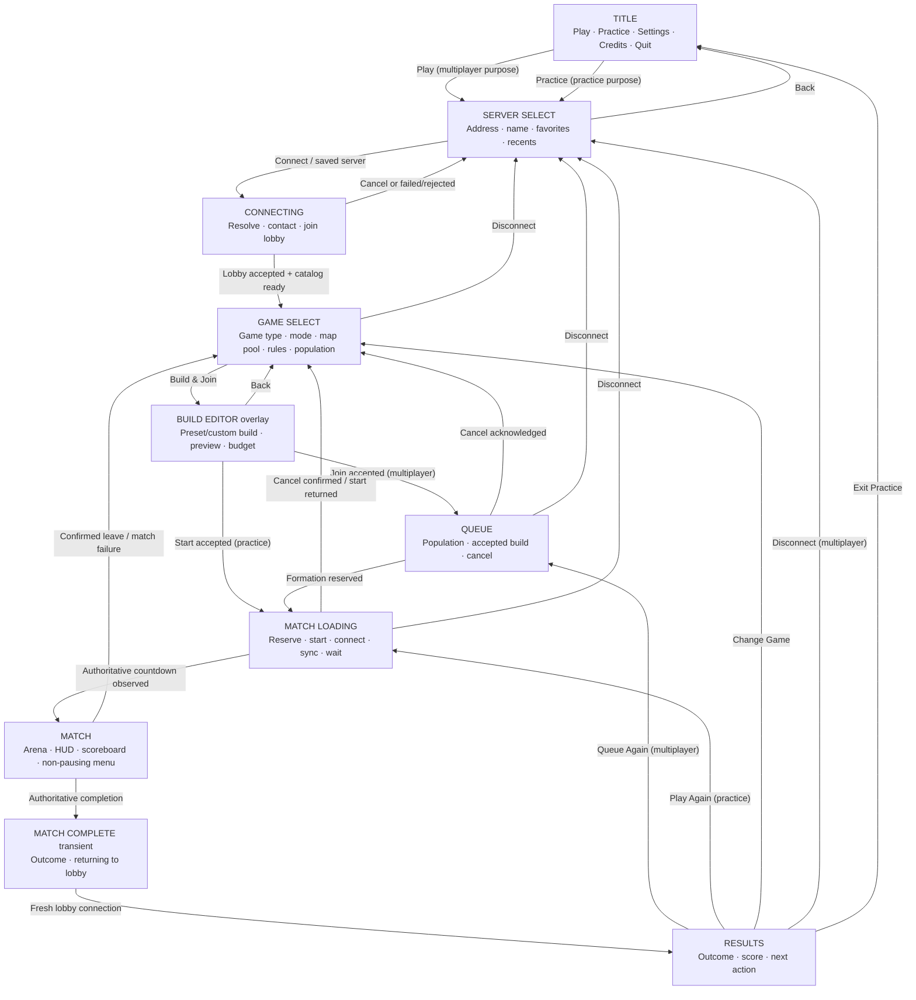
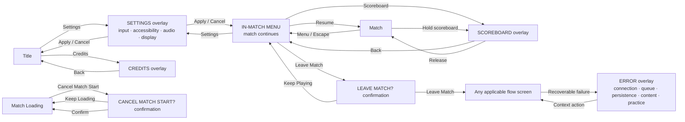

# Brawler screen-flow map

Status: current implemented windowed-client behavior as of 2026-08-21.

This map is a review aid for the post-V4 screen and menu pass. It follows the normal product shell
implemented in `src/client/shell.rs`, `src/client/flow.rs`, and `src/client/presentation.rs`. It does
not describe headless automation or developer diagnostics.

## Primary flow

Multiplayer and practice deliberately share Server Select and Game Select. The selected
`SessionPurpose` changes the action after Build Editor: multiplayer joins Queue; practice requests
an immediate practice reservation and skips Queue.

## Overlay and menu map

The in-match menu is not a `ClientOverlay` variant. It is driven by the menu input context, while
the Scoreboard can be held during play or latched from that menu. Opening the menu suppresses local
gameplay input but never pauses the authoritative match.

## Screen inventory

| Surface | Layer | Main actions or states | Return/exit behavior |
|---|---|---|---|
| Title | Primary | Play, Practice, Settings, Credits, Quit | Starts a session path or exits the app |
| Server Select | Primary | Edit address/name, connect, join/remove favorite, join recent, Back | Back to Title |
| Connecting | Primary | Resolving, contacting, joining; Cancel | Success to Game Select; failure to Server Select with Error |
| Game Select | Primary | Select advertised game type, open Build Editor, favorite server, disconnect | Disconnect to Server Select |
| Build Editor | Modal overlay | Four presets, custom recipe fields, preview/budget, Join/Start, Back, Disconnect | Back to Game Select; accepted multiplayer build to Queue; accepted practice build to Match Loading |
| Queue | Primary | Live population and accepted build, Cancel Queue, Disconnect | Cancel to Game Select; formation to Match Loading |
| Match Loading | Primary | Reserving, server start, connecting, synchronizing, waiting, cancelling/returning | Countdown to Match; cancel confirmation available |
| Match | Primary world | Gameplay HUD and arena | Completion/leave/failure returns through the lobby path |
| Match Complete | Transient full-screen layer | Outcome and “Returning to lobby…” | Automatically advances to Results after lobby return |
| Results | Primary | Queue/Play Again, Change Game, Disconnect/Exit Practice | Depends on session purpose |
| In-match menu | Match layer | Resume, Settings, Scoreboard, Leave Match | Resume or return from child overlay; match continues |
| Scoreboard | Match layer | Held during play or latched from menu | Release to Match or Back to in-match menu |
| Settings | Modal overlay | Input calibration/rebinding, inversion, UI scale, reduced motion/effects, volume, focus mute, fullscreen, VSync, Reset/Apply/Cancel | Returns to Title or in-match menu, depending on entry point |
| Credits | Modal overlay | Attribution and license summary | Back to Title |
| Cancel Match Start | Confirmation overlay | Keep Loading, Cancel Match Start | Returns to Match Loading while cancellation resolves |
| Leave Match | Confirmation overlay | Keep Playing, Leave Match | Back to in-match menu or forfeit/return-to-lobby path |
| Error | Modal overlay | Context-specific retry, edit, back, continue, or disconnect actions | Explicit `return_flow` or recovery action |

## Review notes

1. **Practice is server-oriented.** The title action does not launch a local arena; it asks the
   player to select a server, then a game type, before starting a practice match with inert bots.
2. **Build editing is one step behind Game Select.** The game card selection and fighter build are
   separate surfaces, although the Game Select call to action combines them as “Build & Join” or
   “Build & Start Practice.”
3. **There are two completion presentations.** Match Complete is an automatic lobby-return bridge;
   Results is the interactive decision screen.
4. **Settings has two return destinations.** Title entry returns to Title; match-menu entry restores
   the still-running in-match menu.
5. **Disconnect is intentionally different from Back.** Once connected to a lobby, Disconnect is
   the ordinary way back to Server Select.
6. **Error is a family of contextual modals, not one fixed screen.** Button sets vary by connection,
   queue, persistence, content, and practice failures.
7. **No separate map-select screen exists.** Game Type owns an advertised map pool; map choice is
   authoritative during formation.
8. **No player-facing pause exists.** The server simulation continues under the in-match menu,
   Settings, Scoreboard, and leave confirmation.

## Implementation anchors

- `ClientFlow` and `ClientOverlay`: `src/client/flow.rs`
- Title, Settings, Credits, and their return behavior: `src/client/shell.rs`
- In-match menu and Scoreboard behavior: `src/client/presentation.rs`
- Product-flow intent and enduring constraints: `docs/13-player-ux.md`
