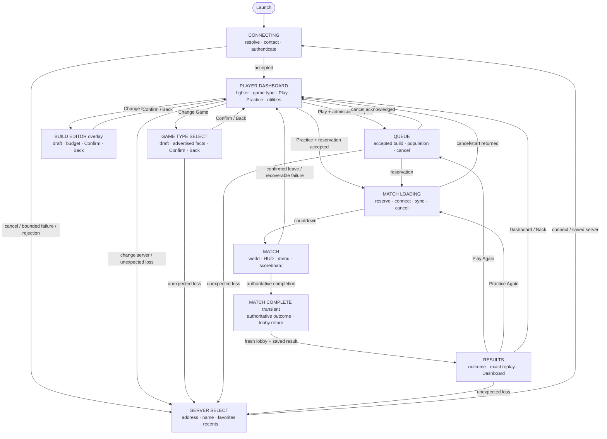
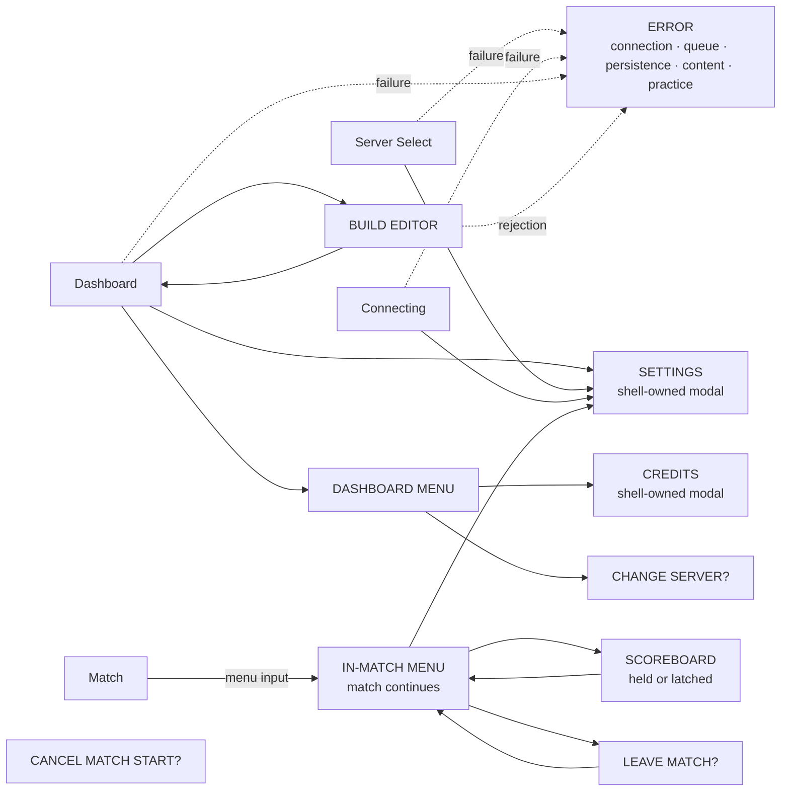
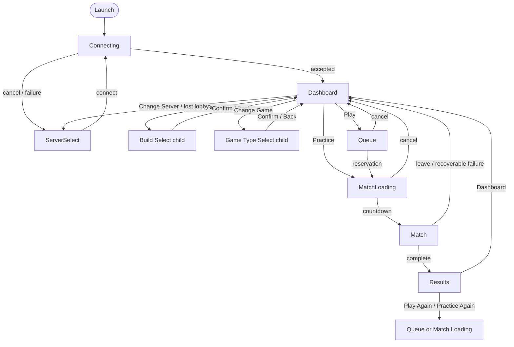

# PewPew Blitz screen-flow audit

Status: V5 M02 implementation map, updated on 2026-08-21.

This document describes the normal windowed product client after the V5 M02 navigation convergence.
Headless automation, developer diagnostics, and the legacy direct-UDP harness are not player
screens.

## Current primary flow

There is no Title screen or Title navigation layer. `ClientFlow::GameTypeSelect` remains a primary
state for state-scoped rendering, but its product contract is a Dashboard child: rows edit a local
draft, Confirm commits an exact current advertisement, and Back discards it. It contains no
admission, server, or favorite controls.

## Current overlay and in-match layers

The in-match menu is not a `ClientOverlay`; it is represented by `ClientInputContext::Menu`.
Scoreboard visibility is separately held or latched. Settings bridges both models through
`SettingsReturnTarget`; its neutral destination is now named `ProductFlow`, with no Title concept.

## Complete player-surface inventory

| Surface | Runtime owner | Current role | M02 result |
|---|---|---|---|
| Connecting | `ClientFlow::Connecting` | Initial auto-connect progress; Cancel, Settings, Quit | Keep |
| Server Select | `ClientFlow::ServerSelect` | Recovery/manual server and display-name selection | Keep; Back must not imply a removed Title destination |
| Player Dashboard | `ClientFlow::Dashboard` | Sole authenticated home | Keep as the connected return target |
| Game Type Select | `ClientFlow::GameTypeSelect` | Pure Dashboard child with draft, Confirm, and Back | Implemented |
| Build Editor | `ClientOverlay::BuildEditor` | Dashboard child for accepted local build selection | Implemented; no join/start/disconnect ownership |
| Queue | `ClientFlow::Queue` | Accepted multiplayer ticket and cancellation | Successful cancellation returns Dashboard |
| Match Loading | `ClientFlow::MatchLoading` | Reserved match connection/readiness and cancellation | Successful cancellation/return reaches Dashboard |
| Match | `ClientFlow::Match` | Authoritative gameplay | Keep |
| Match Complete | `MatchCompletionRoot` over Match | Non-interactive cover while reconnecting to lobby | Keep as a transient bridge, not a destination |
| Results | `ClientFlow::Results` | Authoritative outcome, exact replay, and Dashboard | Implemented; stale exact replay is disabled factually |
| Dashboard Menu | `ClientOverlay::DashboardMenu` | Credits, favorite server, Change Server, Quit | Keep |
| Settings | `ClientOverlay::Settings` plus shell UI | Local settings from recovery, Dashboard, or match menu | ProductFlow/MatchMenu return terminology; no Title owner |
| Credits | `ClientOverlay::Credits` plus shell UI | Attribution reached from Dashboard Menu | Keep |
| Change Server confirmation | `ClientOverlay::ChangeServerConfirmation` | Confirms authenticated disconnect | Keep |
| Cancel Match Start confirmation | `ClientOverlay::Confirmation` | Confirms reservation cancellation | Keep |
| In-match menu | `ClientInputContext::Menu` | Non-pausing Resume, Settings, Scoreboard, Leave | Keep |
| Leave Match confirmation | `ClientOverlay::LeaveConfirmation` | Confirms return-to-lobby request | Keep; successful lobby return reaches Dashboard |
| Scoreboard | `ScoreboardOverlay` | Held during play or latched from match menu | Keep |
| Error | `ClientOverlay::Error` | Contextual recovery modal | Keep; connected recoverable errors return to their child or Dashboard |
| Legacy in-match build selection | replicated `SelectingBuild` + `BuildSelectionText` | Direct-UDP diagnostic waiting-phase UI | Hidden and input-gated whenever the V5 product shell is composed |
| Diagnostics overlay | diagnostics plugin | Developer authority/network evidence | Exclude from product navigation map |

The readiness timer, objective HUD, countdown numeral, phase message, combat HUD, and roster
Scoreboard are sublayers of Match rather than navigation destinations. Their visibility follows
replicated match state and does not create additional exits.

## M02 remnant resolution

All player-visible findings from the M02 audit are implemented:

1. queue/loading cancellation and leave/no-result return converge on Dashboard;
2. Results owns only exact replay and Dashboard, and local Back never disconnects;
3. Game Type Select has a private draft plus Confirm/Back and no hub controls;
4. Build Editor has one Dashboard-child selection contract and no admission controls;
5. queue retry remains with its frozen command owner and never reopens an editor;
6. current-generation lobby loss includes Results and ignores stale disconnected match entities;
7. `SessionPurpose` is reset on Dashboard entry and describes only active admission/results;
8. dead Title UI, controls, return names, and fixtures are removed;
9. README and the V2 UX record explicitly identify the current V5 startup/connected loop;
10. the replicated waiting-phase build selector is gated away from product-shell composition.

Historical V2 milestone files remain unchanged as versioned evidence. A small number of test/temp
path labels still contain their originating milestone number; those labels are non-player-visible
and do not encode navigation ownership.

## Current connected-loop summary

Results enables replay only when the exact previous game-type ID still exists
in the fresh lobby catalog. If it is absent, keep the authoritative result visible, disable replay
with a factual reason, and leave Dashboard available. A recoverable capacity/rate rejection remains
on Results; a catalog/protocol incompatibility follows the explicit reconnect recovery path. The
server still validates the advertised game, accepted build, queue admission, reservation, map, and
outcome.

## M03 Dashboard presentation contract

The navigation graph does not change with window size. At an effective UI canvas of at least
`1000x640`, Dashboard uses the accepted Wide header, central fighter/build card, and horizontal game
type/Practice/Play row. Below either threshold it uses the same semantic targets in a vertically
scrollable Compact layout. Effective size is the logical window size divided by the persisted UI
scale.

Keyboard arrows/WASD and controller D-pad follow spatial neighbors in Wide and visible order in
Compact; disabled targets are skipped and a disabled focused target is repaired deterministically.
Compact focus follows the selected action into view. Pointer activation, keyboard/controller
activation, and accessibility labels all feed the same flow action owner, so responsive presentation
cannot create a second navigation or authority path.

## Implementation anchors

- primary states, overlays, actions, and transition coordinator: `src/client/flow.rs`
- build draft versus accepted selection: `src/client/build_editor.rs`
- settings/credits shell and legacy Title remnants: `src/client/shell.rs`
- in-match menu and scoreboard: `src/client/presentation.rs`
- completion capture and routed lobby return: `src/client/session.rs`
- queue/loading command ownership: `src/client/queue.rs`
- V5 milestone contract: `docs/implementation/v5/milestone-02.md`
